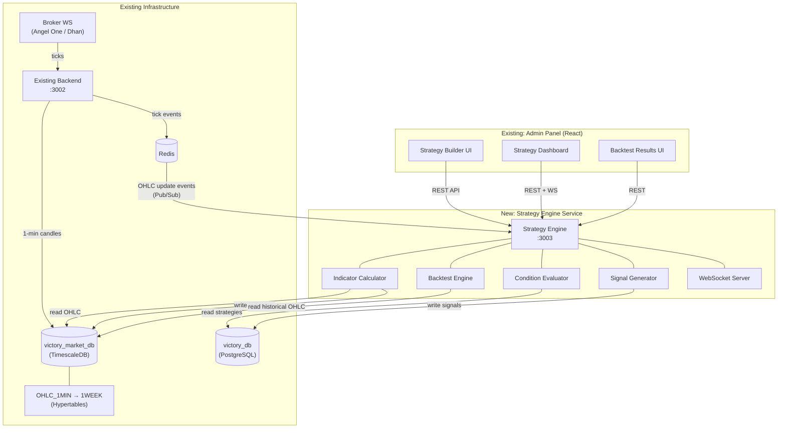
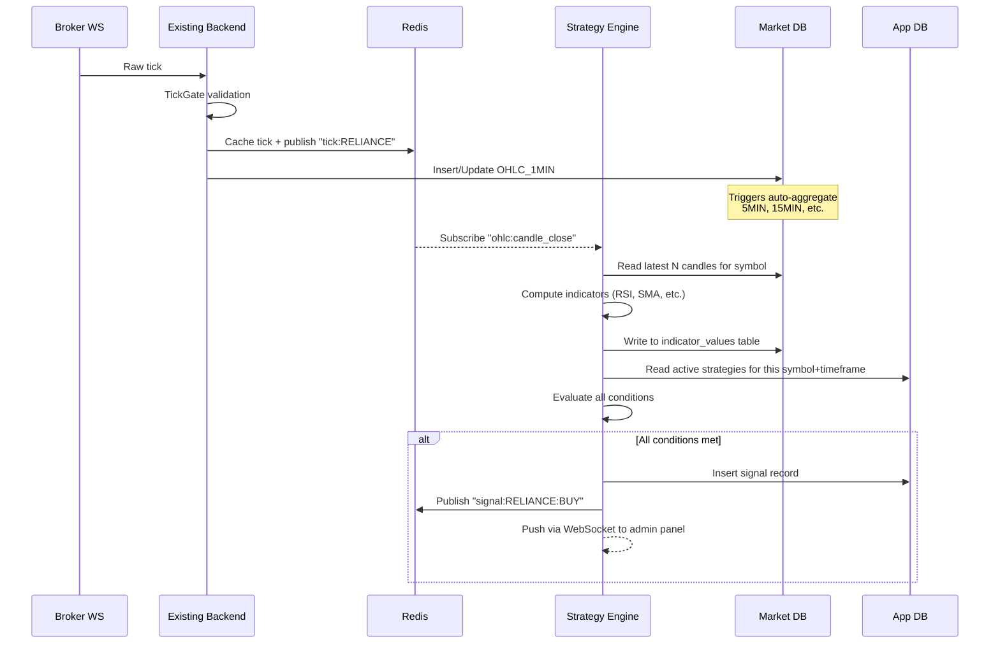
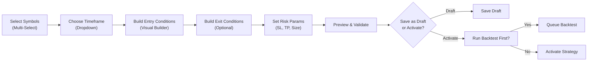
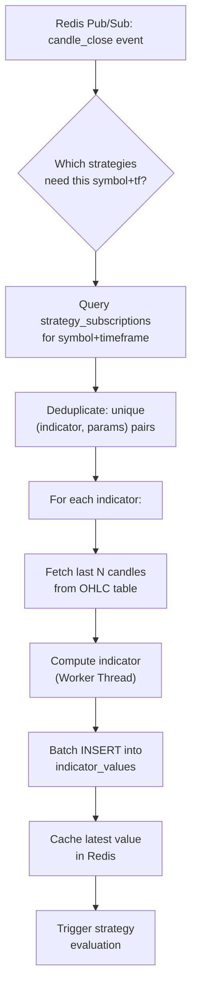
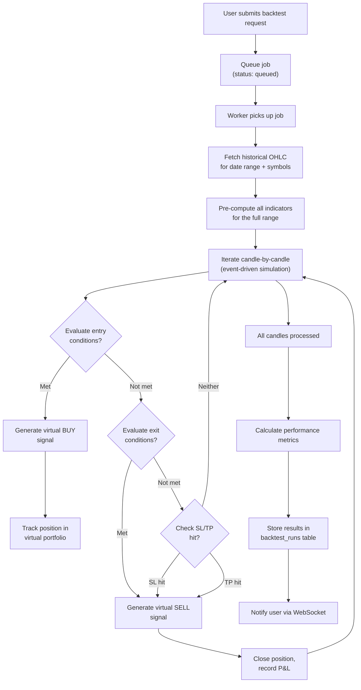

# Trading Strategy Builder Platform — Implementation Plan

> **Scope**: New standalone backend service + frontend pages integrated into the existing Victory Admin Panel.

## Existing Infrastructure Summary

| Layer | Technology | Details |
|-------|-----------|---------|
| **Admin Panel** | React 19, CRA, React Router v7 | CSS Modules, Axios + Apollo, Redux (permissions only), cookie-based auth |
| **Existing Backend** | Express 5, Node.js | 132 controllers, JWT auth, session-file-store, 134 routes inline in `index.js` |
| **Database** | PostgreSQL + TimescaleDB | Two DBs: `victory_db` (app data), `victory_market_db` (OHLC data) |
| **OHLC Tables** | 9 hypertables | `OHLC_1MIN` → `OHLC_1WEEK`, auto-aggregation triggers from 1MIN |
| **Real-time** | WebSockets (ws) | BrokerManager → TickGate → Redis → Internal WS → Frontend |
| **Brokers** | Angel One (primary), Dhan, Sharekhan | Multi-broker architecture with tick validation pipeline |
| **Cache** | Redis | Prices, ticks, snapshot data |

---

## User Review Required

> [!IMPORTANT]
> **Separate Backend**: This plan creates a **new Node.js service** (Strategy Engine) running on its own port, with its own `package.json`. It connects to the **same PostgreSQL databases** (`victory_db` for strategy/user data, `victory_market_db` for OHLC/indicator data). The existing backend remains untouched.

> [!IMPORTANT]
> **Admin Panel Integration**: The Strategy Builder UI will be added as new pages within the existing Victory Admin Panel under a new `"Strategy Builder"` sidebar section. This follows the existing patterns: CSS Modules, Axios API calls, `useState` controlled forms, `ProtectedRoute` with permission guards.

> [!WARNING]
> **TA-Lib Dependency**: TA-Lib requires native C compilation. On Windows, this needs `windows-build-tools` or pre-built binaries. Alternative: use `technicalindicators` (pure JS, zero native deps) for Phase 1, migrate to TA-Lib in Phase 2 for performance. **Please confirm your preference.**

> [!WARNING]
> **Database Writes**: The strategy engine will write indicator data to `victory_market_db` (new tables). It will create new tables in `victory_db` for strategies, signals, and backtest results. Confirm this is acceptable vs. creating a third database.

---

## Open Questions

> [!IMPORTANT]
> 1. **TA-Lib vs `technicalindicators`**: Do you want native TA-Lib from the start (requires C build toolchain) or pure-JS `technicalindicators` for Phase 1?
> 2. **Deployment target**: Will the strategy engine run on the same EC2 instance as the existing backend, or on a separate server?
> 3. **User model**: Will strategy builder users be the same users in `victory_db.users`? Or is this admin-only (only admin panel users create strategies)?
> 4. **Port allocation**: The existing backend uses port 3002. What port for the strategy engine? (e.g., 3003)
> 5. **Message queue**: For Phase 2+ (scaling to 100K strategies), do you want Redis Pub/Sub (simplest, you already have Redis) or BullMQ (Redis-backed job queue with retries)?

---

## System Architecture

### High-Level Overview



### Data Flow — Candle-to-Signal Pipeline



---

## Architecture Decisions & Tradeoffs

### Monolith vs Microservices

| Approach | Pros | Cons | Verdict |
|----------|------|------|---------|
| **Add to existing backend** | No new deployment, shared auth | Already 132 controllers, CPU-heavy indicator math will block event loop, tight coupling | ❌ |
| **Separate monolith service** | Independent scaling, isolated CPU, clean boundary, shared DB | Two services to manage, need inter-service communication | ✅ **Recommended for Phase 1** |
| **Full microservices** | Max scalability, independent deploys | Premature complexity, operational overhead | Phase 3+ |

### Indicator Storage: Separate Tables vs Single Generic Table

| Approach | Pros | Cons |
|----------|------|------|
| **One table per indicator** (`sma_values`, `rsi_values`) | Type-safe columns, optimized queries | Schema explosion at 100+ indicators, DDL for every new indicator |
| **Single wide table** (all indicator columns) | Fast reads (one row = all indicators) | NULL-heavy, ALTER TABLE for new indicators, lock contention |
| **Generic EAV table** (`indicator_values(symbol, timeframe, ts, indicator_name, params_hash, value)`) | Infinite extensibility, no schema changes | More complex queries, less type safety |
| **Hybrid: Generic + materialized views** | Extensibility + query performance | Slightly more complex setup |

**Recommendation: Generic `indicator_values` table with JSONB params + TimescaleDB hypertable.**

Reasoning:
- At 15 base indicators × 7 timeframes × 5000 stocks = 525,000 indicator series
- Adding custom indicators requires zero schema changes
- JSONB params stores `{"period": 14}` or `{"fast": 12, "slow": 26, "signal": 9}` for any indicator
- TimescaleDB compression handles the write volume
- Materialized views can be added per-indicator for hot paths

### Real-Time Processing Strategy

| Approach | Latency | Complexity | Resource Usage |
|----------|---------|------------|----------------|
| **Polling** (cron every N sec) | 1-60s | Low | Wasteful DB queries |
| **Event-driven** (Redis Pub/Sub) | <100ms | Medium | Efficient, only triggers on data change |
| **Streaming** (Kafka/Flink) | <50ms | Very High | Overkill for Phase 1 |

**Recommendation: Event-driven via Redis Pub/Sub** (Phase 1), migrate to BullMQ queues (Phase 2).

The existing backend already publishes ticks to Redis. We add a `candle_close` event that the strategy engine subscribes to.

---

## Database Schema Design

### New Tables in `victory_market_db` (Market Database)

```sql
-- ============================================================
-- INDICATOR VALUES — Generic, extensible indicator storage
-- ============================================================
CREATE TABLE indicator_values (
    symbol          TEXT NOT NULL,
    exchange        TEXT NOT NULL DEFAULT 'NSE',
    timeframe       TEXT NOT NULL,              -- '1m','5m','15m','30m','1h','4h','1d','1w'
    ts              TIMESTAMPTZ NOT NULL,        -- Candle timestamp this indicator was computed for
    indicator_name  TEXT NOT NULL,               -- 'SMA','RSI','MACD','BBANDS', etc.
    params_hash     TEXT NOT NULL,               -- MD5 of sorted JSON params for fast lookup
    params          JSONB NOT NULL DEFAULT '{}', -- {"period":14} or {"fast":12,"slow":26,"signal":9}
    value           DOUBLE PRECISION,            -- Primary value (SMA value, RSI value, etc.)
    value2          DOUBLE PRECISION,            -- Secondary (MACD signal, BB upper, etc.)
    value3          DOUBLE PRECISION,            -- Tertiary (MACD histogram, BB lower, etc.)
    computed_at     TIMESTAMPTZ NOT NULL DEFAULT NOW()
);

-- Convert to TimescaleDB hypertable partitioned by time
SELECT create_hypertable('indicator_values', 'ts',
    chunk_time_interval => INTERVAL '1 day',
    if_not_exists => TRUE
);

-- Primary lookup: "Give me RSI(14) for RELIANCE on 5m at this time"
CREATE INDEX idx_iv_lookup ON indicator_values (symbol, timeframe, indicator_name, params_hash, ts DESC);

-- Batch computation: "All indicators for RELIANCE on 5m in last hour"
CREATE INDEX idx_iv_symbol_tf_ts ON indicator_values (symbol, timeframe, ts DESC);

-- Enable TimescaleDB compression (for data older than 7 days)
ALTER TABLE indicator_values SET (
    timescaledb.compress,
    timescaledb.compress_segmentby = 'symbol, timeframe, indicator_name, params_hash',
    timescaledb.compress_orderby = 'ts DESC'
);
SELECT add_compression_policy('indicator_values', INTERVAL '7 days');

-- Retention: drop data older than 90 days (configurable)
SELECT add_retention_policy('indicator_values', INTERVAL '90 days');


-- ============================================================
-- INDICATOR REGISTRY — Metadata for all available indicators
-- ============================================================
CREATE TABLE indicator_registry (
    id              SERIAL PRIMARY KEY,
    name            TEXT NOT NULL UNIQUE,          -- 'SMA', 'RSI', 'MACD'
    display_name    TEXT NOT NULL,                 -- 'Simple Moving Average'
    category        TEXT NOT NULL DEFAULT 'trend', -- 'trend','momentum','volatility','volume','custom'
    description     TEXT,
    default_params  JSONB NOT NULL DEFAULT '{}',   -- {"period": 14}
    param_schema    JSONB NOT NULL DEFAULT '{}',   -- JSON Schema for validation
    output_fields   JSONB NOT NULL DEFAULT '["value"]', -- ["value"] or ["value","value2","value3"]
    output_labels   JSONB DEFAULT '{}',            -- {"value":"MACD","value2":"Signal","value3":"Histogram"}
    is_custom       BOOLEAN NOT NULL DEFAULT FALSE,
    is_active       BOOLEAN NOT NULL DEFAULT TRUE,
    created_at      TIMESTAMPTZ NOT NULL DEFAULT NOW(),
    updated_at      TIMESTAMPTZ NOT NULL DEFAULT NOW()
);
```

### New Tables in `victory_db` (Application Database)

```sql
-- ============================================================
-- STRATEGIES — User-defined trading strategies
-- ============================================================
CREATE TABLE strategies (
    id              SERIAL PRIMARY KEY,
    user_id         INTEGER NOT NULL,              -- References users(userid)
    name            TEXT NOT NULL,
    description     TEXT,
    status          TEXT NOT NULL DEFAULT 'draft',  -- 'draft','active','paused','archived'
    symbols         JSONB NOT NULL DEFAULT '[]',    -- ["RELIANCE","TCS","INFY"] or ["*"] for all
    timeframe       TEXT NOT NULL DEFAULT '5m',     -- Primary evaluation timeframe
    condition_tree  JSONB NOT NULL,                 -- Full condition tree (see JSON model below)
    action          JSONB NOT NULL DEFAULT '{}',    -- {"type":"BUY","quantity_type":"fixed","quantity":1}
    
    -- Risk management
    stop_loss       JSONB DEFAULT '{}',             -- {"type":"percentage","value":2}
    trailing_sl     JSONB DEFAULT '{}',             -- {"type":"percentage","value":1,"activation":3}
    take_profit     JSONB DEFAULT '{}',             -- {"type":"percentage","value":5}
    max_trades_day  INTEGER DEFAULT 5,
    capital_alloc   DOUBLE PRECISION DEFAULT 100000,
    risk_per_trade  DOUBLE PRECISION DEFAULT 2.0,   -- percentage
    
    -- Scheduling
    active_days     JSONB DEFAULT '["MON","TUE","WED","THU","FRI"]',
    active_start    TIME DEFAULT '09:15',
    active_end      TIME DEFAULT '15:30',
    
    -- Metadata
    version         INTEGER NOT NULL DEFAULT 1,
    is_deleted      BOOLEAN NOT NULL DEFAULT FALSE,
    created_at      TIMESTAMPTZ NOT NULL DEFAULT NOW(),
    updated_at      TIMESTAMPTZ NOT NULL DEFAULT NOW()
);

CREATE INDEX idx_strategies_user ON strategies (user_id, is_deleted);
CREATE INDEX idx_strategies_status ON strategies (status) WHERE status = 'active';
CREATE INDEX idx_strategies_symbols ON strategies USING GIN (symbols);


-- ============================================================
-- STRATEGY SUBSCRIPTIONS — Which symbols+timeframes a strategy needs
-- (Denormalized for fast evaluation engine lookups)
-- ============================================================
CREATE TABLE strategy_subscriptions (
    id              SERIAL PRIMARY KEY,
    strategy_id     INTEGER NOT NULL REFERENCES strategies(id) ON DELETE CASCADE,
    symbol          TEXT NOT NULL,
    timeframe       TEXT NOT NULL,
    indicator_name  TEXT NOT NULL,       -- 'RSI', 'SMA', etc.
    params_hash     TEXT NOT NULL,       -- Same hash as indicator_values
    params          JSONB NOT NULL,
    is_active       BOOLEAN NOT NULL DEFAULT TRUE,
    
    UNIQUE(strategy_id, symbol, timeframe, indicator_name, params_hash)
);

CREATE INDEX idx_ss_symbol_tf ON strategy_subscriptions (symbol, timeframe) WHERE is_active = TRUE;


-- ============================================================
-- SIGNALS — Generated when strategy conditions are met
-- ============================================================
CREATE TABLE signals (
    id              SERIAL PRIMARY KEY,
    strategy_id     INTEGER NOT NULL REFERENCES strategies(id),
    user_id         INTEGER NOT NULL,
    symbol          TEXT NOT NULL,
    exchange        TEXT NOT NULL DEFAULT 'NSE',
    timeframe       TEXT NOT NULL,
    signal_type     TEXT NOT NULL,         -- 'BUY', 'SELL', 'EXIT_LONG', 'EXIT_SHORT'
    signal_time     TIMESTAMPTZ NOT NULL,
    trigger_price   DOUBLE PRECISION,      -- Price at signal generation
    
    -- Condition snapshot (what triggered it)
    condition_snapshot JSONB NOT NULL DEFAULT '{}', -- Snapshot of all indicator values at trigger
    
    -- Execution tracking
    status          TEXT NOT NULL DEFAULT 'pending', -- 'pending','executed','cancelled','expired'
    executed_at     TIMESTAMPTZ,
    executed_price  DOUBLE PRECISION,
    
    -- Risk params at signal time
    stop_loss_price DOUBLE PRECISION,
    target_price    DOUBLE PRECISION,
    quantity        INTEGER,
    
    created_at      TIMESTAMPTZ NOT NULL DEFAULT NOW()
);

CREATE INDEX idx_signals_strategy ON signals (strategy_id, created_at DESC);
CREATE INDEX idx_signals_user ON signals (user_id, created_at DESC);
CREATE INDEX idx_signals_status ON signals (status, created_at DESC);


-- ============================================================
-- BACKTEST RUNS — Historical strategy testing metadata
-- ============================================================
CREATE TABLE backtest_runs (
    id              SERIAL PRIMARY KEY,
    strategy_id     INTEGER NOT NULL REFERENCES strategies(id),
    user_id         INTEGER NOT NULL,
    
    -- Time range
    start_date      DATE NOT NULL,
    end_date        DATE NOT NULL,
    timeframe       TEXT NOT NULL,
    symbols         JSONB NOT NULL,
    
    -- Configuration snapshot
    strategy_snapshot JSONB NOT NULL,      -- Full strategy config at run time
    initial_capital DOUBLE PRECISION NOT NULL DEFAULT 100000,
    
    -- Status
    status          TEXT NOT NULL DEFAULT 'queued', -- 'queued','running','completed','failed'
    progress        INTEGER DEFAULT 0,              -- 0-100
    error_message   TEXT,
    
    -- Results (populated on completion)
    total_trades    INTEGER,
    winning_trades  INTEGER,
    losing_trades   INTEGER,
    total_pnl       DOUBLE PRECISION,
    max_drawdown    DOUBLE PRECISION,
    sharpe_ratio    DOUBLE PRECISION,
    win_rate        DOUBLE PRECISION,
    avg_win         DOUBLE PRECISION,
    avg_loss        DOUBLE PRECISION,
    profit_factor   DOUBLE PRECISION,
    max_consecutive_wins  INTEGER,
    max_consecutive_losses INTEGER,
    
    -- Detailed results (large JSONB)
    equity_curve    JSONB,                -- [{ts, equity, drawdown}, ...]
    trade_log       JSONB,                -- [{entry_time, exit_time, symbol, side, pnl, ...}, ...]
    monthly_returns JSONB,                -- {"2024-01": 5.2, "2024-02": -1.3, ...}
    
    started_at      TIMESTAMPTZ,
    completed_at    TIMESTAMPTZ,
    created_at      TIMESTAMPTZ NOT NULL DEFAULT NOW()
);

CREATE INDEX idx_bt_strategy ON backtest_runs (strategy_id, created_at DESC);
CREATE INDEX idx_bt_user ON backtest_runs (user_id, created_at DESC);
CREATE INDEX idx_bt_status ON backtest_runs (status);


-- ============================================================
-- STRATEGY TEMPLATES — Pre-built strategy templates
-- ============================================================
CREATE TABLE strategy_templates (
    id              SERIAL PRIMARY KEY,
    name            TEXT NOT NULL,
    description     TEXT,
    category        TEXT NOT NULL DEFAULT 'general', -- 'momentum','trend','mean_reversion','breakout'
    condition_tree  JSONB NOT NULL,
    action          JSONB NOT NULL DEFAULT '{}',
    default_params  JSONB NOT NULL DEFAULT '{}',     -- Default risk params
    difficulty      TEXT DEFAULT 'beginner',          -- 'beginner','intermediate','advanced'
    is_active       BOOLEAN NOT NULL DEFAULT TRUE,
    created_at      TIMESTAMPTZ NOT NULL DEFAULT NOW()
);
```

### Strategy Condition Tree — JSON Model

This is the core data model. A strategy's conditions are stored as a **tree of groups and conditions**, enabling arbitrary nesting with AND/OR logic.

```json
{
  "entry": {
    "operator": "AND",
    "conditions": [
      {
        "type": "indicator",
        "indicator": "RSI",
        "params": { "period": 14 },
        "timeframe": "5m",
        "field": "value",
        "comparator": ">",
        "compare_to": { "type": "constant", "value": 60 }
      },
      {
        "type": "indicator_cross",
        "left": { "indicator": "SMA", "params": { "period": 10 }, "timeframe": "5m", "field": "value" },
        "right": { "indicator": "SMA", "params": { "period": 20 }, "timeframe": "5m", "field": "value" },
        "cross_type": "crosses_above"
      },
      {
        "operator": "OR",
        "conditions": [
          {
            "type": "price",
            "field": "volume",
            "comparator": ">",
            "compare_to": { "type": "constant", "value": 100000 }
          },
          {
            "type": "time",
            "comparator": ">",
            "value": "09:20"
          }
        ]
      }
    ]
  },
  "exit": {
    "operator": "OR",
    "conditions": [
      {
        "type": "indicator",
        "indicator": "RSI",
        "params": { "period": 14 },
        "timeframe": "5m",
        "field": "value",
        "comparator": "<",
        "compare_to": { "type": "constant", "value": 40 }
      }
    ]
  }
}
```

### Condition Types Supported

| Type | Description | Example |
|------|-------------|---------|
| `indicator` | Compare indicator value to constant or another indicator | RSI(14) > 60 |
| `indicator_cross` | Crossover/crossunder detection | SMA(10) crosses above SMA(20) |
| `price` | OHLCV field comparison | Volume > 100000, Close > Open |
| `time` | Time-of-day filter | Time > 09:20 |
| `change` | Percentage/absolute change | RSI(14) increased by 5 in last 3 candles |
| `candle_pattern` | Candlestick patterns (future) | Bullish Engulfing |
| `group` | Nested AND/OR group | (A AND B) OR (C AND D) |

---

## Backend Service Design — Strategy Engine

### Project Structure

```
D:\StrategyEngine\
├── package.json
├── .env
├── .env.example
├── nodemon.json
├── src/
│   ├── index.js                    # Express server + WS setup
│   ├── config/
│   │   ├── env.js                  # Environment config
│   │   ├── db.js                   # victory_db pool (same credentials)
│   │   ├── marketDb.js             # victory_market_db pool
│   │   └── redis.js                # Redis client
│   ├── middleware/
│   │   ├── auth.js                 # JWT verification (same secret as existing)
│   │   ├── errorHandler.js
│   │   └── validate.js             # Request validation
│   ├── routes/
│   │   ├── indicator.routes.js
│   │   ├── strategy.routes.js
│   │   ├── signal.routes.js
│   │   ├── backtest.routes.js
│   │   └── template.routes.js
│   ├── controllers/
│   │   ├── indicator.controller.js
│   │   ├── strategy.controller.js
│   │   ├── signal.controller.js
│   │   ├── backtest.controller.js
│   │   └── template.controller.js
│   ├── services/
│   │   ├── indicatorEngine/
│   │   │   ├── index.js            # Indicator computation orchestrator
│   │   │   ├── registry.js         # Indicator registration & lookup
│   │   │   ├── calculator.js       # Main calculation dispatcher
│   │   │   ├── indicators/         # Individual indicator implementations
│   │   │   │   ├── sma.js
│   │   │   │   ├── ema.js
│   │   │   │   ├── rsi.js
│   │   │   │   ├── macd.js
│   │   │   │   ├── adx.js
│   │   │   │   ├── atr.js
│   │   │   │   ├── vwap.js
│   │   │   │   ├── cci.js
│   │   │   │   ├── mfi.js
│   │   │   │   ├── obv.js
│   │   │   │   ├── supertrend.js
│   │   │   │   ├── bollingerBands.js
│   │   │   │   ├── stochastic.js
│   │   │   │   └── ichimoku.js
│   │   │   └── cache.js            # Redis indicator cache layer
│   │   ├── strategyEngine/
│   │   │   ├── evaluator.js        # Condition tree evaluator
│   │   │   ├── crossDetector.js    # Crossover/crossunder logic
│   │   │   ├── scheduler.js        # Strategy scheduling (market hours, active days)
│   │   │   └── subscriptionManager.js  # Manages which symbols need which indicators
│   │   ├── signalService/
│   │   │   ├── generator.js        # Signal generation from evaluations
│   │   │   └── notifier.js         # WebSocket + optional push notifications
│   │   ├── backtestEngine/
│   │   │   ├── runner.js           # Backtest execution loop
│   │   │   ├── simulator.js        # Order simulation (fills, slippage)
│   │   │   ├── portfolio.js        # Portfolio tracking during backtest
│   │   │   └── metrics.js          # Performance metrics calculation
│   │   └── riskEngine/
│   │       ├── stopLoss.js         # SL / Trailing SL calculator
│   │       ├── positionSizer.js    # Position sizing logic
│   │       └── limits.js           # Max trades, exposure limits
│   ├── sockets/
│   │   └── signalSocket.js         # WebSocket for real-time signal push
│   ├── workers/
│   │   ├── indicatorWorker.js      # Offloads CPU-intensive indicator math
│   │   └── backtestWorker.js       # Offloads backtest processing
│   ├── migrations/
│   │   ├── 001_indicator_tables.sql
│   │   ├── 002_strategy_tables.sql
│   │   ├── 003_signal_tables.sql
│   │   ├── 004_backtest_tables.sql
│   │   ├── 005_template_tables.sql
│   │   └── 006_seed_indicators.sql
│   └── utils/
│       ├── paramsHash.js           # Deterministic params hashing
│       ├── timeframes.js           # Timeframe utilities
│       └── validation.js           # Schema validators
```

### API Design

#### Indicator APIs

| Method | Endpoint | Description |
|--------|----------|-------------|
| `GET` | `/api/indicators` | List all available indicators from registry |
| `GET` | `/api/indicators/:name` | Get indicator details + param schema |
| `GET` | `/api/indicators/compute` | Compute indicator on-demand (for preview) |
| `GET` | `/api/indicators/values` | Get stored indicator values for symbol+timeframe |

#### Strategy APIs

| Method | Endpoint | Description |
|--------|----------|-------------|
| `GET` | `/api/strategies` | List user's strategies (paginated) |
| `POST` | `/api/strategies` | Create new strategy |
| `GET` | `/api/strategies/:id` | Get strategy details |
| `PUT` | `/api/strategies/:id` | Update strategy |
| `DELETE` | `/api/strategies/:id` | Soft-delete strategy |
| `POST` | `/api/strategies/:id/activate` | Activate strategy (start evaluation) |
| `POST` | `/api/strategies/:id/pause` | Pause strategy |
| `POST` | `/api/strategies/:id/clone` | Clone a strategy |
| `POST` | `/api/strategies/:id/validate` | Validate condition tree without saving |

#### Signal APIs

| Method | Endpoint | Description |
|--------|----------|-------------|
| `GET` | `/api/signals` | List signals (filterable by strategy, status, date) |
| `GET` | `/api/signals/:id` | Get signal details with condition snapshot |
| `GET` | `/api/signals/live` | WebSocket upgrade for real-time signals |

#### Backtest APIs

| Method | Endpoint | Description |
|--------|----------|-------------|
| `POST` | `/api/backtests` | Queue a new backtest |
| `GET` | `/api/backtests/:id` | Get backtest status + results |
| `GET` | `/api/backtests/:id/trades` | Get detailed trade log |
| `GET` | `/api/backtests/:id/equity-curve` | Get equity curve data |
| `DELETE` | `/api/backtests/:id` | Delete backtest run |

#### Template APIs

| Method | Endpoint | Description |
|--------|----------|-------------|
| `GET` | `/api/templates` | List strategy templates |
| `GET` | `/api/templates/:id` | Get template details |
| `POST` | `/api/templates/:id/use` | Create strategy from template |

---

## Admin Panel Frontend — UI Design

### New Sidebar Section

Add to the existing sidebar `menuItems` array in [Sidebar.jsx](file:///D:/Admin-panel/Victory_Admin_Pannel/src/components/layout/Sidebar/Sidebar.jsx):

```javascript
{
  label: "Strategy Builder",
  icon: <span className="material-symbols-outlined">psychology</span>,
  children: [
    { path: "/strategies",     icon: <span className="material-symbols-outlined">schema</span>,        label: "My Strategies",    permissions: "VIEW_STRATEGIES" },
    { path: "/strategy/new",   icon: <span className="material-symbols-outlined">add_circle</span>,    label: "Create Strategy",  permissions: "VIEW_STRATEGIES" },
    { path: "/signals",        icon: <span className="material-symbols-outlined">notifications_active</span>, label: "Signals",    permissions: "VIEW_SIGNALS" },
    { path: "/backtests",      icon: <span className="material-symbols-outlined">history</span>,       label: "Backtests",        permissions: "VIEW_BACKTESTS" },
    { path: "/templates",      icon: <span className="material-symbols-outlined">dashboard_customize</span>, label: "Templates",  permissions: "VIEW_TEMPLATES" },
    { path: "/indicators",     icon: <span className="material-symbols-outlined">analytics</span>,     label: "Indicators",       permissions: "VIEW_INDICATORS" },
  ]
}
```

### Page Components

```
src/pages/
├── StrategyBuilder/
│   ├── StrategyList/
│   │   ├── StrategyList.jsx         # List view with status badges, actions
│   │   └── StrategyList.module.css
│   ├── StrategyForm/
│   │   ├── StrategyForm.jsx         # Main strategy builder page
│   │   ├── StrategyForm.module.css
│   │   ├── ConditionBuilder.jsx     # Drag-and-drop condition tree builder
│   │   ├── ConditionRow.jsx         # Single condition row (indicator, comparator, value)
│   │   ├── ConditionGroup.jsx       # AND/OR group container
│   │   ├── IndicatorPicker.jsx      # Dropdown to select indicator + params
│   │   ├── SymbolSelector.jsx       # Multi-symbol selector (reuse StockPicker pattern)
│   │   ├── RiskSettings.jsx         # SL, TSL, TP, position sizing panel
│   │   └── StrategyPreview.jsx      # JSON preview + validation status
│   └── StrategyDetail/
│       ├── StrategyDetail.jsx       # View mode with signal history
│       └── StrategyDetail.module.css
├── Signals/
│   ├── SignalDashboard.jsx          # Real-time signal feed
│   └── SignalDashboard.module.css
├── Backtests/
│   ├── BacktestList/
│   │   ├── BacktestList.jsx
│   │   └── BacktestList.module.css
│   └── BacktestDetail/
│       ├── BacktestDetail.jsx       # Charts, equity curve, trade log, metrics
│       └── BacktestDetail.module.css
├── Templates/
│   ├── TemplateList.jsx
│   └── TemplateList.module.css
└── Indicators/
    ├── IndicatorList.jsx            # Available indicators with docs
    └── IndicatorList.module.css
```

### Strategy Builder UI — Interaction Flow



### Condition Builder UI — Component Architecture

The condition builder is the core UX piece. Each condition row provides:

```
┌─────────────────────────────────────────────────────────────────────┐
│ [AND ▾]                                                    [+ Add] │
│ ┌─────────────────────────────────────────────────────────────────┐ │
│ │ [RSI ▾] [Period: 14] [5m ▾]  [> ▾]  [Constant ▾] [60    ]  ✕ │ │
│ └─────────────────────────────────────────────────────────────────┘ │
│ ┌─────────────────────────────────────────────────────────────────┐ │
│ │ [SMA ▾] [Period: 10] [5m ▾]  [crosses above ▾]                │ │
│ │                       [SMA ▾] [Period: 20] [5m ▾]            ✕ │ │
│ └─────────────────────────────────────────────────────────────────┘ │
│ ┌ [OR ▾] ──────────────────────────────────────────────── [+ Add]┐ │
│ │ ┌───────────────────────────────────────────────────────────┐   │ │
│ │ │ [Volume ▾]              [> ▾]  [Constant ▾] [100000] ✕   │   │ │
│ │ └───────────────────────────────────────────────────────────┘   │ │
│ │ ┌───────────────────────────────────────────────────────────┐   │ │
│ │ │ [Time ▾]                [> ▾]  [09:20      ]          ✕   │   │ │
│ │ └───────────────────────────────────────────────────────────┘   │ │
│ └────────────────────────────────────────────────────────────────┘ │
│                                                    [+ Add Group]   │
└─────────────────────────────────────────────────────────────────────┘
```

---

## Indicator Computation Engine — Detailed Design

### Computation Pipeline



### Indicator Implementation Pattern

Each indicator follows a standard interface:

```javascript
// src/services/indicatorEngine/indicators/rsi.js
module.exports = {
  name: 'RSI',
  displayName: 'Relative Strength Index',
  category: 'momentum',
  defaultParams: { period: 14 },
  paramSchema: {
    period: { type: 'integer', min: 2, max: 100, default: 14 }
  },
  outputFields: ['value'],
  outputLabels: { value: 'RSI' },
  
  // Minimum candles needed for computation
  requiredCandles: (params) => params.period + 1,
  
  /**
   * @param {Array} candles - [{open, high, low, close, volume, ts}, ...]
   * @param {Object} params - { period: 14 }
   * @returns {{ value: number }} - Latest indicator value(s)
   */
  compute(candles, params) {
    const { period } = params;
    const closes = candles.map(c => c.close);
    // ... RSI calculation
    return { value: rsiValue };
  },
  
  /**
   * Compute full series (for backtesting / charting)
   * @returns {Array<{ts, value}>}
   */
  computeSeries(candles, params) {
    // Returns array of values for each candle
  }
};
```

### Multi-Output Indicators

| Indicator | `value` | `value2` | `value3` |
|-----------|---------|----------|----------|
| SMA | SMA value | — | — |
| RSI | RSI value | — | — |
| MACD | MACD line | Signal line | Histogram |
| Bollinger Bands | Middle band | Upper band | Lower band |
| Stochastic | %K | %D | — |
| Ichimoku | Tenkan | Kijun | Senkou A (Senkou B via separate row) |
| SuperTrend | ST value | Direction (1/-1) | — |

---

## Strategy Evaluation Engine — Detailed Design

### Evaluator Logic

```javascript
// Pseudocode for condition tree evaluation
function evaluateConditionTree(tree, context) {
  if (tree.operator) {
    // It's a group (AND/OR)
    const results = tree.conditions.map(c => evaluateConditionTree(c, context));
    return tree.operator === 'AND'
      ? results.every(Boolean)
      : results.some(Boolean);
  }
  
  // It's a leaf condition
  switch (tree.type) {
    case 'indicator':
      return evaluateIndicatorCondition(tree, context);
    case 'indicator_cross':
      return evaluateCrossCondition(tree, context);
    case 'price':
      return evaluatePriceCondition(tree, context);
    case 'time':
      return evaluateTimeCondition(tree, context);
    case 'change':
      return evaluateChangeCondition(tree, context);
  }
}
```

### Crossover Detection

Crossovers require comparing **current** and **previous** candle values:

```javascript
function evaluateCrossCondition(condition, context) {
  const leftCurrent  = getIndicatorValue(condition.left, context, 0);   // current candle
  const leftPrevious = getIndicatorValue(condition.left, context, -1);  // previous candle
  const rightCurrent  = getIndicatorValue(condition.right, context, 0);
  const rightPrevious = getIndicatorValue(condition.right, context, -1);
  
  switch (condition.cross_type) {
    case 'crosses_above':
      return leftPrevious <= rightPrevious && leftCurrent > rightCurrent;
    case 'crosses_below':
      return leftPrevious >= rightPrevious && leftCurrent < rightCurrent;
  }
}
```

---

## Backtest Engine — Architecture



### Performance Metrics Calculated

| Metric | Formula | Description |
|--------|---------|-------------|
| Total P&L | Sum of all trade P&Ls | Net profit/loss |
| Win Rate | Winning trades / Total trades × 100 | % of profitable trades |
| Profit Factor | Gross profit / Gross loss | >1 is profitable |
| Sharpe Ratio | (Mean return - Rf) / StdDev(returns) | Risk-adjusted return |
| Max Drawdown | Max peak-to-trough decline | Worst losing streak |
| Avg Win | Mean of winning trade P&Ls | Average profit per win |
| Avg Loss | Mean of losing trade P&Ls | Average loss per loss |
| Max Consecutive Wins/Losses | Longest streak | Streak analysis |
| Calmar Ratio | Annualized Return / Max Drawdown | Drawdown-adjusted return |

---

## Risk Management Engine

### Stop Loss Types

```javascript
const stopLossTypes = {
  fixed:       { type: 'fixed',       value: 150 },        // ₹150 below entry
  percentage:  { type: 'percentage',  value: 2 },           // 2% below entry
  atr:         { type: 'atr',         multiplier: 2, period: 14 }, // 2×ATR(14) below entry
  indicator:   { type: 'indicator',   indicator: 'SuperTrend', params: { period: 10, multiplier: 3 } }
};
```

### Trailing Stop Loss

```javascript
// Updates every candle
function updateTrailingSL(position, currentPrice, config) {
  const { type, value, activation } = config;
  
  // Only activate after position is in profit by 'activation' %
  const profitPct = ((currentPrice - position.entryPrice) / position.entryPrice) * 100;
  if (profitPct < activation) return position.currentSL;
  
  let newSL;
  if (type === 'percentage') {
    newSL = currentPrice * (1 - value / 100);
  } else if (type === 'fixed') {
    newSL = currentPrice - value;
  }
  
  // Trailing SL only moves up, never down
  return Math.max(position.currentSL || 0, newSL);
}
```

---

## Scalability Strategy

### Phase 1 (Current Target — up to 1,000 strategies)

| Component | Approach | Rationale |
|-----------|----------|-----------|
| Indicator computation | Single Node.js process + Worker Threads | Sufficient for < 5K symbol-indicator pairs |
| Strategy evaluation | In-process, triggered by Redis Pub/Sub | Low latency, simple architecture |
| Backtest | Worker thread, one at a time | Acceptable for admin-only usage |
| Database | Shared PostgreSQL + TimescaleDB | Existing infra, no new services |
| Cache | Existing Redis instance | Already available |

### Phase 2 (10,000+ strategies)

| Component | Upgrade | Why |
|-----------|---------|-----|
| Indicator computation | BullMQ job queues with multiple workers | Distribute across CPU cores |
| Strategy evaluation | Batch evaluation (group strategies by symbol+tf) | N strategies on same symbol = 1 indicator fetch |
| Backtest | Dedicated backtest worker process | Isolate CPU from live evaluation |
| Database | Read replicas for backtest queries | Don't impact live indicator writes |

### Phase 3 (100,000+ strategies)

| Component | Upgrade | Why |
|-----------|---------|-----|
| Architecture | Kubernetes pods with auto-scaling | Horizontal scaling |
| Message queue | Kafka for tick distribution | Guaranteed delivery, replay capability |
| Indicator computation | Distributed workers per symbol-group | Partition by symbol hash |
| Database | TimescaleDB multi-node | Distribute time-series storage |
| Caching | Redis Cluster | High-availability cache |

---

## Deployment Architecture

### Phase 1 — Single Server

```
┌─────────────────────── EC2 Instance ───────────────────────┐
│                                                             │
│  ┌──────────────┐  ┌──────────────────┐  ┌──────────────┐ │
│  │  Existing     │  │  Strategy Engine  │  │  Redis       │ │
│  │  Backend      │  │  Service          │  │  (existing)  │ │
│  │  :3002        │  │  :3003            │  │  :6379       │ │
│  └──────────────┘  └──────────────────┘  └──────────────┘ │
│                                                             │
│  ┌──────────────────────────────────────────────────────┐  │
│  │  PostgreSQL + TimescaleDB                             │  │
│  │  victory_db (:5432)  |  victory_market_db (:5432)     │  │
│  └──────────────────────────────────────────────────────┘  │
│                                                             │
│  ┌──────────────────────────────────────────────────────┐  │
│  │  Nginx (Reverse Proxy)                                │  │
│  │  /api/* → :3002  |  /strategy-api/* → :3003           │  │
│  └──────────────────────────────────────────────────────┘  │
└─────────────────────────────────────────────────────────────┘
```

### Docker Compose (Phase 2)

```yaml
services:
  strategy-engine:
    build: ./StrategyEngine
    ports: ["3003:3003"]
    depends_on: [redis, postgres]
    environment:
      - NODE_ENV=production
      - PG_HOST=postgres
      - REDIS_URL=redis://redis:6379
    deploy:
      resources:
        limits:
          cpus: '2'
          memory: 2G

  strategy-worker:
    build: ./StrategyEngine
    command: node src/workers/indicatorWorker.js
    depends_on: [redis, postgres]
    deploy:
      replicas: 2
```

---

## Security

| Concern | Implementation |
|---------|---------------|
| **Authentication** | Same JWT secret as existing backend (`JWT_SECRET`). Token extracted from cookie/header. |
| **Authorization** | Same RBAC model. New permissions: `VIEW_STRATEGIES`, `VIEW_SIGNALS`, `VIEW_BACKTESTS`, `VIEW_TEMPLATES`, `VIEW_INDICATORS` |
| **Rate Limiting** | `express-rate-limit` — 100 req/min for API, 10 req/min for backtest submissions |
| **Input Validation** | Joi/Zod schema validation on all strategy condition trees before DB write |
| **SQL Injection** | Parameterized queries only (existing pattern) |
| **Condition Tree Safety** | Max depth: 5 levels, max conditions: 50, max symbols per strategy: 100 |
| **Backtest Abuse** | Max concurrent backtests per user: 3, max date range: 2 years |
| **CORS** | Same origin policy, only admin panel domain |

---

## Monitoring & Observability

| Metric | Tool | What to Track |
|--------|------|---------------|
| Indicator computation time | Console logger (Phase 1), Prometheus (Phase 2) | Avg/p95/p99 per indicator |
| Strategy evaluation latency | Timer middleware | Time from candle close to signal generation |
| Active strategies count | Periodic counter | Capacity planning |
| Backtest queue depth | BullMQ dashboard (Phase 2) | Backtest wait times |
| DB connection pool | `pg` pool events | Available vs busy connections |
| Redis memory | Redis INFO | Cache hit ratio, memory usage |
| Error rates | Error handler middleware | 4xx vs 5xx breakdown |

---

## Verification Plan

### Automated Tests

```bash
# Run migrations and seed data
node src/migrations/run.js

# Unit tests (indicator calculations)
npm test -- --testPathPattern="indicators"

# Integration tests (API endpoints)
npm test -- --testPathPattern="routes"

# Backtest accuracy test (known-result strategy)
npm test -- --testPathPattern="backtest.accuracy"
```

### Manual Verification

1. **Indicator accuracy**: Compare RSI(14), SMA(20) values against TradingView for same symbol/timeframe/date
2. **Strategy evaluation**: Create a test strategy with known conditions, manually verify signal generation
3. **Backtest correctness**: Run a simple SMA crossover strategy on historical data, manually verify trade entries/exits
4. **Admin panel UI**: Visual walkthrough of strategy creation flow, condition builder, backtest results
5. **WebSocket signals**: Activate a strategy during market hours, verify real-time signal delivery

---

## Phase-Wise Implementation Roadmap

### Phase 1 — Foundation (4-6 weeks)
- [ ] Project scaffolding, DB migrations, seed data
- [ ] Indicator engine (all 15 base indicators)
- [ ] Strategy CRUD APIs
- [ ] Condition tree evaluator
- [ ] Admin panel: Strategy list + form + condition builder
- [ ] Basic signal generation
- [ ] Manual indicator computation endpoint

### Phase 2 — Backtesting & Real-Time (3-4 weeks)
- [ ] Backtest engine with worker threads
- [ ] Backtest results UI (equity curve, trade log, metrics)
- [ ] Redis Pub/Sub integration for real-time indicator updates
- [ ] Real-time strategy evaluation pipeline
- [ ] WebSocket signal push to admin panel
- [ ] Strategy templates (pre-built strategies)

### Phase 3 — Risk & Polish (2-3 weeks)
- [ ] Risk management engine (SL, TSL, TP, position sizing)
- [ ] Signal dashboard with real-time feed
- [ ] Strategy performance tracking
- [ ] Indicator registry UI in admin panel
- [ ] Custom indicator support (user-defined formulas)

### Phase 4 — Scaling & Production (2-3 weeks)
- [ ] BullMQ worker queues for indicator computation
- [ ] Docker containerization
- [ ] Nginx reverse proxy configuration
- [ ] Monitoring and alerting setup
- [ ] Load testing and optimization
- [ ] Production deployment

### Future Phases
- Paper trading with virtual portfolio
- Live trading with broker integration (existing Angel One / Dhan adapters)
- Strategy marketplace
- AI-generated strategies
- Multi-timeframe condition support in single strategy
- Mobile app integration

---

## Potential Bottlenecks & Mitigations

| Bottleneck | Impact | Mitigation |
|------------|--------|------------|
| 5000 stocks × 15 indicators × 7 timeframes = **525K computations per candle close** | CPU saturation | Batch by symbol, compute only indicators that active strategies need (subscription-based) |
| OHLC reads for indicator computation | DB I/O spike on every candle close | Redis cache for last N candles per symbol+timeframe |
| `indicator_values` table growth (millions of rows/day) | Storage + query degradation | TimescaleDB compression (10x reduction), 90-day retention policy |
| Backtest on 2 years of 1-min data (500K+ candles) | Memory + CPU | Stream candles in chunks, compute indicators incrementally |
| Multiple strategies on same symbol evaluated redundantly | Wasted CPU | Group strategies by (symbol, timeframe), share indicator values |
| `condition_tree` JSONB parsing overhead | CPU on each evaluation | Pre-parse and cache condition tree AST on strategy activation |

---

## Key Tradeoffs

| Decision | Chosen | Alternative | Why |
|----------|--------|-------------|-----|
| Separate service vs monolith | Separate | Add to existing 132-controller backend | CPU isolation, independent scaling, clean separation |
| Generic indicator table vs per-indicator tables | Generic | Per-indicator | Extensibility without schema changes, custom indicators need zero DDL |
| `technicalindicators` (JS) vs TA-Lib (C) | JS first, TA-Lib later | TA-Lib from start | Zero native deps in Phase 1, easier CI/CD, Windows-friendly |
| Redis Pub/Sub vs Kafka | Redis Pub/Sub | Kafka | Already have Redis, Kafka is overkill for Phase 1 |
| Worker Threads vs Child Processes | Worker Threads | Child Processes | Shared memory, lower overhead, built into Node.js |
| JSONB condition tree vs normalized condition tables | JSONB | Normalized | Simpler queries, atomic reads, flexible nesting, no N+1 |
