# Trading Strategy Builder Platform — Implementation Plan

> **What we're building**: A platform where users can create trading strategies (like "Buy when RSI goes above 60 AND SMA crosses up") without writing code. The system evaluates these strategies in real-time against live market data, generates buy/sell signals, and lets users backtest strategies on historical data.

> **How it fits in**: A brand-new standalone backend service (Strategy Engine) + new pages added into the existing Victory Admin Panel.

---

## Complete End-to-End System Map

*This single diagram shows the ENTIRE system — from a broker sending a price tick all the way to the user seeing a BUY/SELL signal on their screen. Everything on the left already exists. Everything on the right is what we're building.*

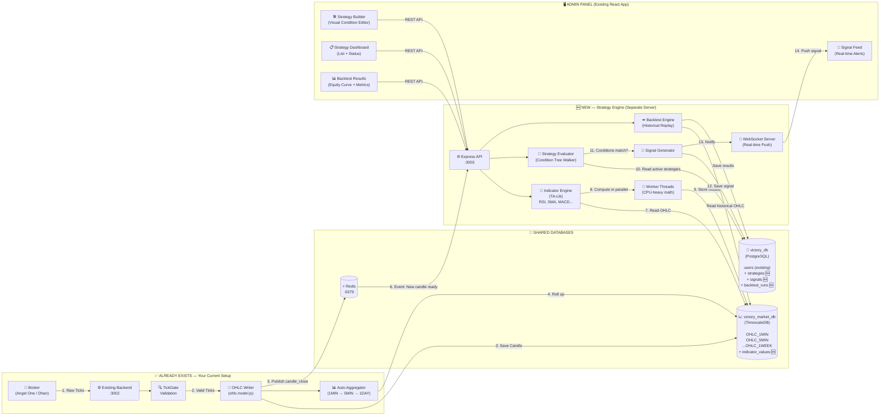

### Reading the Diagram — The 14-Step Journey of a Signal

| Step | What happens | Where |
|------|-------------|-------|
| 1 | Broker sends raw price tick for RELIANCE | Broker → Backend |
| 2 | TickGate validates tick (no stale/duplicate data) | Backend |
| 3 | Valid tick becomes a 1-minute candle, saved to `OHLC_1MIN` | Backend → Market DB |
| 4 | Auto-aggregation rolls up 1MIN → 5MIN → 15MIN → ... → 1WEEK | Market DB |
| 5 | Backend publishes `ohlc:candle_close` event to Redis | Backend → Redis |
| 6 | Strategy Engine picks up the event instantly | Redis → Strategy Engine |
| 7 | Indicator Engine reads last N candles from the appropriate OHLC table | Strategy Engine → Market DB |
| 8 | TA-Lib computes RSI, SMA, MACD etc. on a Worker Thread (won't block API) | Worker Thread |
| 9 | Computed indicator values stored in `indicator_values` table | Worker Thread → Market DB |
| 10 | Evaluator finds all active strategies watching this symbol+timeframe | Strategy Engine → App DB |
| 11 | Evaluator walks the condition tree: "Is RSI > 60? Is SMA crossed?" | Strategy Engine |
| 12 | If ALL conditions match → signal created and saved | Strategy Engine → App DB |
| 13 | Signal pushed to WebSocket server | Strategy Engine |
| 14 | User sees "🟢 BUY RELIANCE @ ₹1,072" in real-time on their screen | WebSocket → Admin Panel |

---

## Decisions Made

| Question | Answer |
|----------|--------|
| Indicator library | **TA-Lib** (native C, highest performance) |
| Deployment | **Separate server** (not on existing EC2 instance) |
| Who can use it? | **All users** (not admin-only) |
| Strategy Engine port | **3003** |
| Message queue | **Redis Pub/Sub** (you already have Redis) |
| Existing OHLC tables | **Untouched** — we read from them, never modify them |

---

## Existing Infrastructure Summary

*This is what you already have running. We won't touch any of this — only read from it.*

| Layer | Technology | Details |
|-------|-----------|---------|
| **Admin Panel** | React 19, CRA, React Router v7 | CSS Modules, Axios + Apollo, Redux (permissions only), cookie-based auth |
| **Existing Backend** | Express 5, Node.js | 132 controllers, JWT auth, session-file-store, 134 routes inline in `index.js` |
| **Database** | PostgreSQL + TimescaleDB | Two DBs: `victory_db` (app data), `victory_market_db` (OHLC data) |
| **OHLC Tables** | 9 hypertables | `OHLC_1MIN` → `OHLC_1WEEK`, auto-aggregation from 1MIN candles |
| **Real-time** | WebSockets (ws) | BrokerManager → TickGate → Redis → Internal WS → Frontend |
| **Brokers** | Angel One (primary), Dhan, Sharekhan | Multi-broker architecture with tick validation pipeline |
| **Cache** | Redis | Prices, ticks, snapshot data |

### How Your OHLC Data Works (Plain English)

Your existing backend already does this:
1. **Broker sends ticks** → Backend receives them via WebSocket
2. **Ticks become 1-minute candles** → Inserted into `OHLC_1MIN` table
3. **Auto-aggregation kicks in** → 1-minute data is rolled up into `OHLC_5MIN`, `OHLC_15MIN`, `OHLC_30MIN`, `OHLC_1HOUR`, `OHLC_4HOUR`, `OHLC_1DAY`, `OHLC_1WEEK`
4. **Each table is a TimescaleDB hypertable** → Optimized for time-series queries

The OHLC tables have these columns (quoted, uppercase):
```
"Symbol" | "ExchangeID" | "token" | "Time" | "Open" | "High" | "Low" | "Close" | "Volume" | "total_volume" | "trade_counts" | "broker"
```

**Our Strategy Engine will only READ from these tables. It will never write to them or modify their structure.**

---

## System Architecture

### High-Level Overview

*Think of it like this: Your existing backend is the "data collector" — it collects ticks and builds candles. Our new Strategy Engine is the "brain" — it reads those candles, computes indicators, checks strategy conditions, and fires signals.*

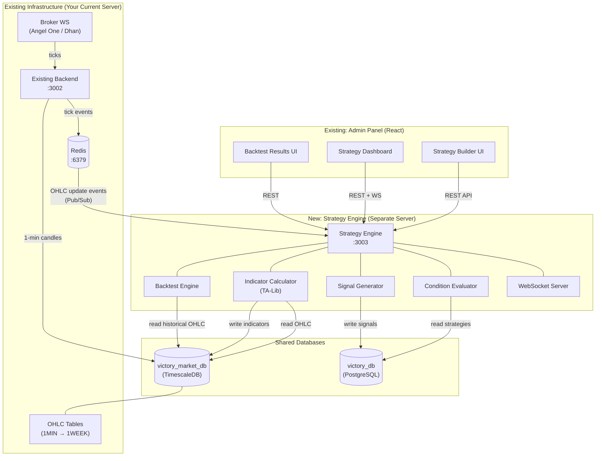

### Data Flow — How a Signal Gets Generated (Plain English)

Here's what happens every time a new candle closes (e.g., every 1 minute for 1MIN data):

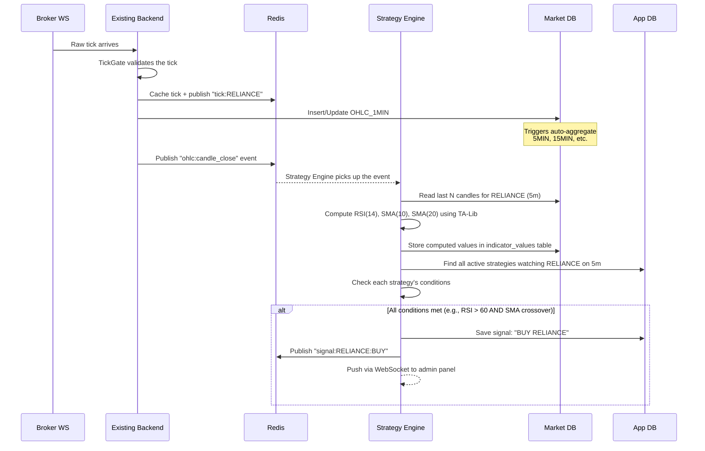

**In simple terms**: Broker sends price → Backend saves candle → Tells Redis "new candle ready" → Strategy Engine wakes up → Computes indicators → Checks your strategy rules → If rules match → Fires a BUY/SELL signal.

### What Runs Where — Two-Server Split

*This diagram makes it clear exactly what runs on each server and how they communicate:*

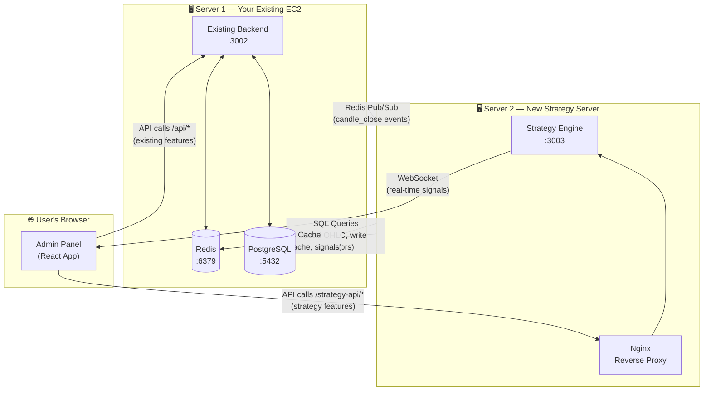

**Key takeaway**: The two servers share the same database and Redis. They communicate through Redis Pub/Sub events. The admin panel talks to both servers — existing API for current features, strategy API for new features.

---

## Architecture Decisions & Tradeoffs

### Why a Separate Service? (Not Adding to Existing Backend)

Your existing backend already has **132 controllers and 134 routes**. Adding CPU-heavy indicator computation (TA-Lib calculates RSI, MACD, Bollinger Bands etc. on every candle close) would **block the event loop** and slow down your entire notification system, market data feeds, and user APIs.

| Approach | Pros | Cons | Verdict |
|----------|------|------|---------|
| **Add to existing backend** | No new deployment, shared auth | Already 132 controllers, CPU-heavy indicator math will block event loop, tight coupling | ❌ |
| **Separate monolith service** | Independent scaling, isolated CPU, clean boundary, shared DB | Two services to manage, need inter-service communication | ✅ **Chosen** |
| **Full microservices** | Max scalability, independent deploys | Premature complexity, operational overhead | Phase 3+ |

### How We Store Indicator Values (The Smart Way)

Instead of adding columns to your OHLC tables (like SMA_10, SMA_20 — which would mean altering tables every time you add a new indicator), we use a **single generic table**:

| Approach | Pros | Cons |
|----------|------|------|
| **One table per indicator** (`sma_values`, `rsi_values`) | Type-safe columns, optimized queries | Schema explosion at 100+ indicators, DDL for every new indicator |
| **Add columns to OHLC tables** (like SMA_10, SMA_20) | Fast reads (one row = all data) | NULL-heavy, ALTER TABLE for new indicators, modifies existing tables |
| **Single generic table** (`indicator_values`) | Infinite extensibility, no schema changes ever, zero risk to existing tables | Slightly more complex queries |

**Chosen: Generic `indicator_values` table.** You can add RSI, MACD, Bollinger Bands, SuperTrend, or any custom indicator — and the table structure never changes. Zero risk to your existing OHLC tables.

### Visual: Why Generic Table Beats Adding Columns

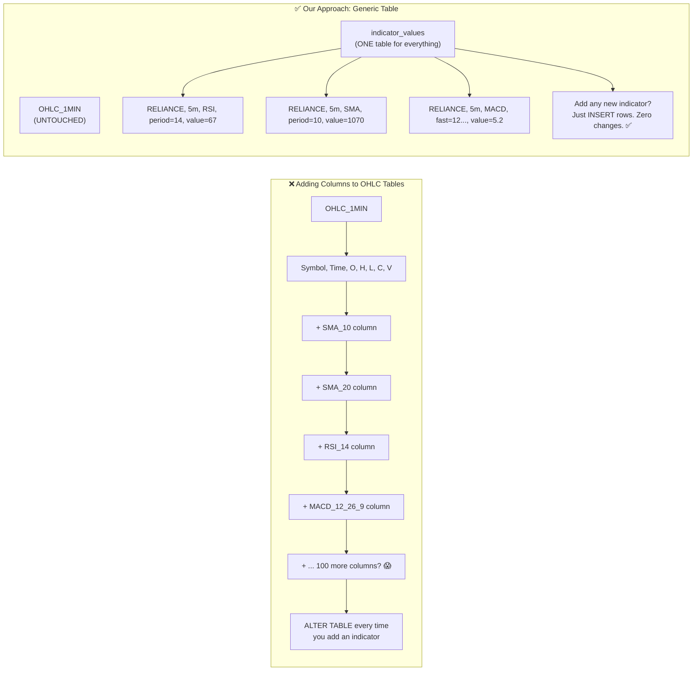

### Real-Time Processing — How the Engine Stays Up-to-Date

| Approach | Latency | Complexity | Resource Usage |
|----------|---------|------------|----------------|
| **Polling** (check DB every N seconds) | 1-60s | Low | Wasteful DB queries |
| **Event-driven** (Redis Pub/Sub) | <100ms | Medium | Efficient, only triggers on data change |
| **Streaming** (Kafka/Flink) | <50ms | Very High | Overkill for Phase 1 |

**Chosen: Redis Pub/Sub.** Your existing backend already publishes ticks to Redis. We add a `candle_close` event that the Strategy Engine subscribes to. When a candle closes, the engine wakes up instantly — no polling, no wasted resources.

---

## Database Schema Design

### New Tables in `victory_market_db` (Market Database)

*These tables store computed indicator values. They sit alongside your existing OHLC tables but never touch them.*

```sql
-- ============================================================
-- INDICATOR VALUES — Where all computed indicators are stored
-- ============================================================
-- Example row: symbol="RELIANCE", timeframe="5m", indicator_name="RSI",
--              params={period:14}, value=67.5
-- 
-- This single table stores ALL indicator types. When you add a new indicator
-- (say, CCI or Williams %R), you just insert rows — no table changes needed.
-- ============================================================
CREATE TABLE indicator_values (
    symbol          TEXT NOT NULL,
    exchange        TEXT NOT NULL DEFAULT 'NSE',
    timeframe       TEXT NOT NULL,              -- '1m','5m','15m','30m','1h','4h','1d','1w'
    ts              TIMESTAMPTZ NOT NULL,        -- Candle timestamp this indicator was computed for
    indicator_name  TEXT NOT NULL,               -- 'SMA','RSI','MACD','BBANDS', etc.
    params_hash     TEXT NOT NULL,               -- MD5 of sorted JSON params (for fast lookups)
    params          JSONB NOT NULL DEFAULT '{}', -- {"period":14} or {"fast":12,"slow":26,"signal":9}
    value           DOUBLE PRECISION,            -- Primary value (SMA value, RSI value, MACD line)
    value2          DOUBLE PRECISION,            -- Secondary (MACD signal line, BB upper band)
    value3          DOUBLE PRECISION,            -- Tertiary (MACD histogram, BB lower band)
    computed_at     TIMESTAMPTZ NOT NULL DEFAULT NOW()
);

-- Make it a TimescaleDB hypertable (fast time-range queries, automatic partitioning)
SELECT create_hypertable('indicator_values', 'ts',
    chunk_time_interval => INTERVAL '1 day',
    if_not_exists => TRUE
);

-- Index: "Give me RSI(14) for RELIANCE on 5m at this time"
CREATE INDEX idx_iv_lookup ON indicator_values (symbol, timeframe, indicator_name, params_hash, ts DESC);

-- Index: "All indicators for RELIANCE on 5m in last hour"
CREATE INDEX idx_iv_symbol_tf_ts ON indicator_values (symbol, timeframe, ts DESC);

-- Auto-compress old data (saves ~90% storage after 7 days)
ALTER TABLE indicator_values SET (
    timescaledb.compress,
    timescaledb.compress_segmentby = 'symbol, timeframe, indicator_name, params_hash',
    timescaledb.compress_orderby = 'ts DESC'
);
SELECT add_compression_policy('indicator_values', INTERVAL '7 days');

-- Auto-delete data older than 90 days (configurable)
SELECT add_retention_policy('indicator_values', INTERVAL '90 days');


-- ============================================================
-- INDICATOR REGISTRY — List of all available indicators
-- ============================================================
-- This is like a "menu" of indicators users can pick from when
-- building strategies. Each row describes one indicator type.
-- ============================================================
CREATE TABLE indicator_registry (
    id              SERIAL PRIMARY KEY,
    name            TEXT NOT NULL UNIQUE,          -- 'SMA', 'RSI', 'MACD'
    display_name    TEXT NOT NULL,                 -- 'Simple Moving Average'
    category        TEXT NOT NULL DEFAULT 'trend', -- 'trend','momentum','volatility','volume','custom'
    description     TEXT,
    default_params  JSONB NOT NULL DEFAULT '{}',   -- {"period": 14}
    param_schema    JSONB NOT NULL DEFAULT '{}',   -- JSON Schema for UI form validation
    output_fields   JSONB NOT NULL DEFAULT '["value"]', -- ["value"] or ["value","value2","value3"]
    output_labels   JSONB DEFAULT '{}',            -- {"value":"MACD","value2":"Signal","value3":"Histogram"}
    is_custom       BOOLEAN NOT NULL DEFAULT FALSE,
    is_active       BOOLEAN NOT NULL DEFAULT TRUE,
    created_at      TIMESTAMPTZ NOT NULL DEFAULT NOW(),
    updated_at      TIMESTAMPTZ NOT NULL DEFAULT NOW()
);
```

### New Tables in `victory_db` (Application Database)

*These tables store strategies, signals, and backtest results. They sit alongside your existing app tables (users, notifications, etc.).*

```sql
-- ============================================================
-- STRATEGIES — The trading rules users create
-- ============================================================
-- Each strategy is basically: "For these stocks, on this timeframe,
-- when these conditions are true, generate a BUY/SELL signal."
-- 
-- The conditions are stored as a JSON tree (explained below).
-- ============================================================
CREATE TABLE strategies (
    id              SERIAL PRIMARY KEY,
    user_id         INTEGER NOT NULL,              -- References users(userid) in your existing users table
    name            TEXT NOT NULL,
    description     TEXT,
    status          TEXT NOT NULL DEFAULT 'draft',  -- 'draft' = saved but not running
                                                    -- 'active' = being evaluated every candle
                                                    -- 'paused' = temporarily stopped
                                                    -- 'archived' = soft-deleted
    symbols         JSONB NOT NULL DEFAULT '[]',    -- ["RELIANCE","TCS","INFY"] or ["*"] for all
    timeframe       TEXT NOT NULL DEFAULT '5m',     -- Which candle timeframe to evaluate on
    condition_tree  JSONB NOT NULL,                 -- The actual strategy logic (JSON tree)
    action          JSONB NOT NULL DEFAULT '{}',    -- {"type":"BUY","quantity_type":"fixed","quantity":1}
    
    -- Risk management settings
    stop_loss       JSONB DEFAULT '{}',             -- {"type":"percentage","value":2} = 2% SL
    trailing_sl     JSONB DEFAULT '{}',             -- {"type":"percentage","value":1,"activation":3}
    take_profit     JSONB DEFAULT '{}',             -- {"type":"percentage","value":5} = 5% target
    max_trades_day  INTEGER DEFAULT 5,              -- Max signals per day
    capital_alloc   DOUBLE PRECISION DEFAULT 100000, -- Capital allocated to this strategy
    risk_per_trade  DOUBLE PRECISION DEFAULT 2.0,   -- Risk % per trade
    
    -- When should this strategy run?
    active_days     JSONB DEFAULT '["MON","TUE","WED","THU","FRI"]',
    active_start    TIME DEFAULT '09:15',           -- IST market open
    active_end      TIME DEFAULT '15:30',           -- IST market close
    
    -- Metadata
    version         INTEGER NOT NULL DEFAULT 1,
    is_deleted      BOOLEAN NOT NULL DEFAULT FALSE,
    created_at      TIMESTAMPTZ NOT NULL DEFAULT NOW(),
    updated_at      TIMESTAMPTZ NOT NULL DEFAULT NOW()
);

CREATE INDEX idx_strategies_user ON strategies (user_id, is_deleted);
CREATE INDEX idx_strategies_status ON strategies (status) WHERE status = 'active';
CREATE INDEX idx_strategies_symbols ON strategies USING GIN (symbols);


-- ============================================================
-- STRATEGY SUBSCRIPTIONS — Quick lookup table
-- ============================================================
-- When a strategy is activated, we extract all the indicators it
-- needs and store them here. This way, when a candle closes for
-- RELIANCE on 5m, we can instantly find: "Which indicators do we
-- need to compute for this symbol+timeframe?"
-- 
-- Without this table, we'd have to parse every strategy's
-- condition_tree JSON on every candle close — very slow.
-- ============================================================
CREATE TABLE strategy_subscriptions (
    id              SERIAL PRIMARY KEY,
    strategy_id     INTEGER NOT NULL REFERENCES strategies(id) ON DELETE CASCADE,
    symbol          TEXT NOT NULL,
    timeframe       TEXT NOT NULL,
    indicator_name  TEXT NOT NULL,       -- 'RSI', 'SMA', etc.
    params_hash     TEXT NOT NULL,       -- Same hash as indicator_values table
    params          JSONB NOT NULL,
    is_active       BOOLEAN NOT NULL DEFAULT TRUE,
    
    UNIQUE(strategy_id, symbol, timeframe, indicator_name, params_hash)
);

-- "Which indicators do we need for RELIANCE on 5m?" — answered in <1ms
CREATE INDEX idx_ss_symbol_tf ON strategy_subscriptions (symbol, timeframe) WHERE is_active = TRUE;


-- ============================================================
-- SIGNALS — Generated when a strategy's conditions are met
-- ============================================================
-- Every time a strategy fires (conditions matched), a signal is
-- created here. This is the output of the whole system.
-- ============================================================
CREATE TABLE signals (
    id              SERIAL PRIMARY KEY,
    strategy_id     INTEGER NOT NULL REFERENCES strategies(id),
    user_id         INTEGER NOT NULL,
    symbol          TEXT NOT NULL,
    exchange        TEXT NOT NULL DEFAULT 'NSE',
    timeframe       TEXT NOT NULL,
    signal_type     TEXT NOT NULL,         -- 'BUY', 'SELL', 'EXIT_LONG', 'EXIT_SHORT'
    signal_time     TIMESTAMPTZ NOT NULL,  -- When the signal was generated
    trigger_price   DOUBLE PRECISION,      -- Price at signal generation
    
    -- What triggered this signal (snapshot for debugging)
    condition_snapshot JSONB NOT NULL DEFAULT '{}', -- {"RSI_14": 67.5, "SMA_10": 1070, "SMA_20": 1065}
    
    -- Execution tracking (for future live trading integration)
    status          TEXT NOT NULL DEFAULT 'pending', -- 'pending','executed','cancelled','expired'
    executed_at     TIMESTAMPTZ,
    executed_price  DOUBLE PRECISION,
    
    -- Risk params at signal time
    stop_loss_price DOUBLE PRECISION,
    target_price    DOUBLE PRECISION,
    quantity        INTEGER,
    
    created_at      TIMESTAMPTZ NOT NULL DEFAULT NOW()
);

CREATE INDEX idx_signals_strategy ON signals (strategy_id, created_at DESC);
CREATE INDEX idx_signals_user ON signals (user_id, created_at DESC);
CREATE INDEX idx_signals_status ON signals (status, created_at DESC);


-- ============================================================
-- BACKTEST RUNS — When users test strategies on historical data
-- ============================================================
-- A backtest takes a strategy and "replays" it on old data to see
-- how it would have performed. Results include total P&L, win rate,
-- drawdown, equity curve, and every individual trade.
-- ============================================================
CREATE TABLE backtest_runs (
    id              SERIAL PRIMARY KEY,
    strategy_id     INTEGER NOT NULL REFERENCES strategies(id),
    user_id         INTEGER NOT NULL,
    
    -- Time range to test
    start_date      DATE NOT NULL,
    end_date        DATE NOT NULL,
    timeframe       TEXT NOT NULL,
    symbols         JSONB NOT NULL,
    
    -- Snapshot of strategy at run time (so results stay valid even if strategy is edited later)
    strategy_snapshot JSONB NOT NULL,
    initial_capital DOUBLE PRECISION NOT NULL DEFAULT 100000,
    
    -- Status tracking
    status          TEXT NOT NULL DEFAULT 'queued', -- 'queued','running','completed','failed'
    progress        INTEGER DEFAULT 0,              -- 0-100 percentage
    error_message   TEXT,
    
    -- Results (filled in when backtest completes)
    total_trades    INTEGER,
    winning_trades  INTEGER,
    losing_trades   INTEGER,
    total_pnl       DOUBLE PRECISION,        -- Net profit/loss in ₹
    max_drawdown    DOUBLE PRECISION,        -- Worst peak-to-trough decline
    sharpe_ratio    DOUBLE PRECISION,        -- Risk-adjusted return
    win_rate        DOUBLE PRECISION,        -- % of profitable trades
    avg_win         DOUBLE PRECISION,        -- Average profit per winning trade
    avg_loss        DOUBLE PRECISION,        -- Average loss per losing trade
    profit_factor   DOUBLE PRECISION,        -- Gross profit / Gross loss (>1 = profitable)
    max_consecutive_wins  INTEGER,
    max_consecutive_losses INTEGER,
    
    -- Detailed results (can be large)
    equity_curve    JSONB,                -- [{ts, equity, drawdown}, ...]
    trade_log       JSONB,                -- [{entry_time, exit_time, symbol, side, pnl, ...}, ...]
    monthly_returns JSONB,                -- {"2024-01": 5.2, "2024-02": -1.3, ...}
    
    started_at      TIMESTAMPTZ,
    completed_at    TIMESTAMPTZ,
    created_at      TIMESTAMPTZ NOT NULL DEFAULT NOW()
);

CREATE INDEX idx_bt_strategy ON backtest_runs (strategy_id, created_at DESC);
CREATE INDEX idx_bt_user ON backtest_runs (user_id, created_at DESC);
CREATE INDEX idx_bt_status ON backtest_runs (status);


-- ============================================================
-- STRATEGY TEMPLATES — Pre-built strategies users can start from
-- ============================================================
-- Instead of building from scratch, users can pick a template
-- like "RSI Oversold Bounce" or "MACD Crossover" and customize it.
-- ============================================================
CREATE TABLE strategy_templates (
    id              SERIAL PRIMARY KEY,
    name            TEXT NOT NULL,
    description     TEXT,
    category        TEXT NOT NULL DEFAULT 'general', -- 'momentum','trend','mean_reversion','breakout'
    condition_tree  JSONB NOT NULL,
    action          JSONB NOT NULL DEFAULT '{}',
    default_params  JSONB NOT NULL DEFAULT '{}',     -- Default risk params
    difficulty      TEXT DEFAULT 'beginner',          -- 'beginner','intermediate','advanced'
    is_active       BOOLEAN NOT NULL DEFAULT TRUE,
    created_at      TIMESTAMPTZ NOT NULL DEFAULT NOW()
);
```

### Database Relationship Diagram

*How all the tables relate to each other — both existing and new:*

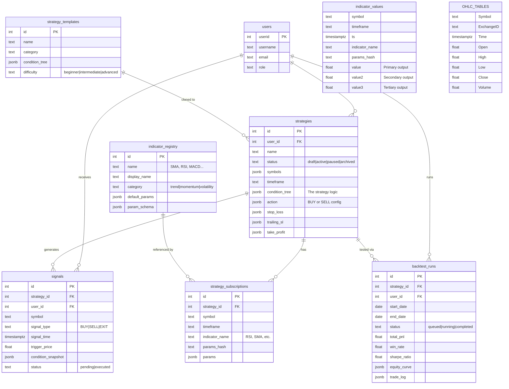

> **Existing tables**: `users`, `OHLC_TABLES` (9 hypertables). **New tables**: everything else.

### Strategy Lifecycle — State Diagram

*A strategy goes through these states. This diagram shows what transitions are allowed:*

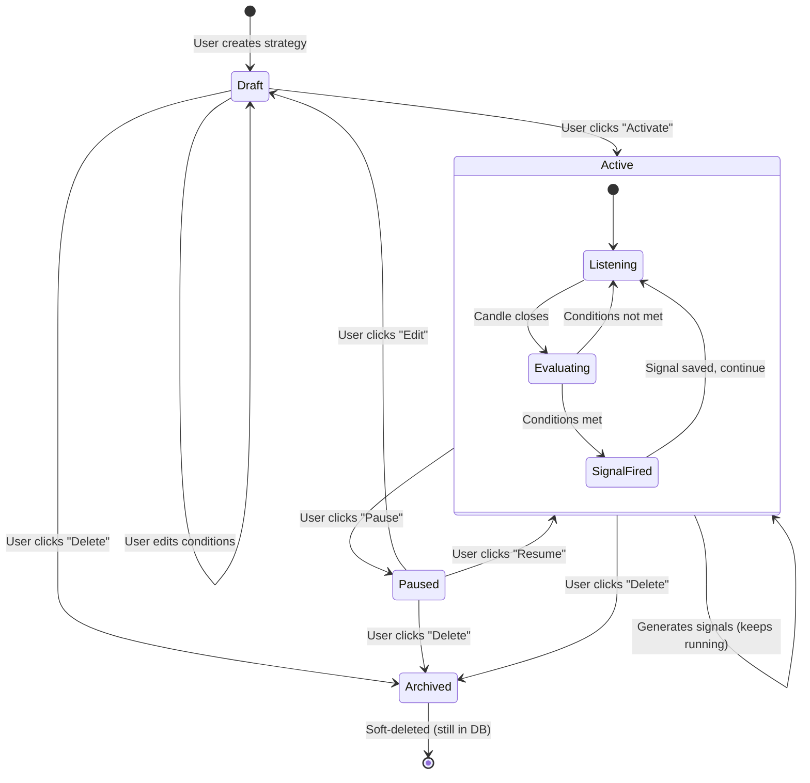

**In plain English**:
- **Draft** = Saved but not running. User is still building/editing it.
- **Active** = The engine is checking this strategy every time a candle closes. If conditions match, it fires a signal.
- **Paused** = Temporarily stopped. No signals generated. Can be resumed instantly.
- **Archived** = Soft-deleted. Still in the database for records, but invisible to the user.

### Strategy Condition Tree — How Strategy Logic is Stored

A strategy's logic is stored as a **JSON tree**. Think of it like a nested IF statement:

> "IF (RSI > 60 **AND** SMA(10) crosses above SMA(20)) **AND** (Volume > 100K **OR** Time > 09:20) → BUY"

This gets stored as:

```json
{
  "entry": {
    "operator": "AND",
    "conditions": [
      {
        "type": "indicator",
        "indicator": "RSI",
        "params": { "period": 14 },
        "timeframe": "5m",
        "field": "value",
        "comparator": ">",
        "compare_to": { "type": "constant", "value": 60 }
      },
      {
        "type": "indicator_cross",
        "left": { "indicator": "SMA", "params": { "period": 10 }, "timeframe": "5m", "field": "value" },
        "right": { "indicator": "SMA", "params": { "period": 20 }, "timeframe": "5m", "field": "value" },
        "cross_type": "crosses_above"
      },
      {
        "operator": "OR",
        "conditions": [
          {
            "type": "price",
            "field": "volume",
            "comparator": ">",
            "compare_to": { "type": "constant", "value": 100000 }
          },
          {
            "type": "time",
            "comparator": ">",
            "value": "09:20"
          }
        ]
      }
    ]
  },
  "exit": {
    "operator": "OR",
    "conditions": [
      {
        "type": "indicator",
        "indicator": "RSI",
        "params": { "period": 14 },
        "timeframe": "5m",
        "field": "value",
        "comparator": "<",
        "compare_to": { "type": "constant", "value": 40 }
      }
    ]
  }
}
```

**In plain English**: The `entry` block says WHEN to buy. The `exit` block says WHEN to sell. Groups can be nested with AND/OR to create complex logic.

### Condition Types the System Supports

| Type | What it does | Example |
|------|-------------|---------|
| `indicator` | Compare an indicator value to a number or another indicator | RSI(14) > 60 |
| `indicator_cross` | Detect when one line crosses another | SMA(10) crosses above SMA(20) |
| `price` | Compare OHLCV fields | Volume > 100000, Close > Open |
| `time` | Filter by time of day | Only trade after 09:20 |
| `change` | Check percentage or absolute change | RSI increased by 5 in last 3 candles |
| `candle_pattern` | Candlestick patterns (future phase) | Bullish Engulfing detected |
| `group` | Nested AND/OR group | (A AND B) OR (C AND D) |

### Visual: How the Condition Tree Gets Evaluated

*The evaluator walks the tree from top to bottom. Each node is either a group (AND/OR) or a leaf (actual comparison):*

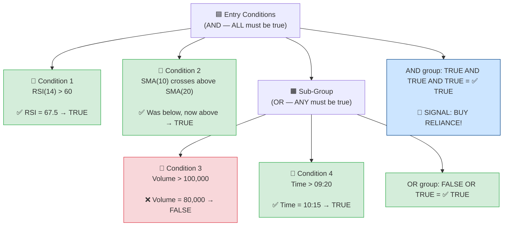

---

## Backend Service Design — Strategy Engine

### Project Structure

```
D:\StrategyEngine\
├── package.json
├── .env
├── .env.example
├── nodemon.json
├── src/
│   ├── index.js                    # Express server + WS setup
│   ├── config/
│   │   ├── env.js                  # Environment config
│   │   ├── db.js                   # victory_db pool (strategies, signals)
│   │   ├── marketDb.js             # victory_market_db pool (OHLC, indicators)
│   │   └── redis.js                # Redis client
│   ├── middleware/
│   │   ├── auth.js                 # JWT verification (same secret as existing backend)
│   │   ├── errorHandler.js
│   │   └── validate.js             # Request validation
│   ├── routes/
│   │   ├── indicator.routes.js
│   │   ├── strategy.routes.js
│   │   ├── signal.routes.js
│   │   ├── backtest.routes.js
│   │   └── template.routes.js
│   ├── controllers/
│   │   ├── indicator.controller.js
│   │   ├── strategy.controller.js
│   │   ├── signal.controller.js
│   │   ├── backtest.controller.js
│   │   └── template.controller.js
│   ├── services/
│   │   ├── indicatorEngine/
│   │   │   ├── index.js            # Indicator computation orchestrator
│   │   │   ├── registry.js         # Indicator registration & lookup
│   │   │   ├── calculator.js       # Main calculation dispatcher
│   │   │   ├── indicators/         # Individual indicator implementations
│   │   │   │   ├── sma.js
│   │   │   │   ├── ema.js
│   │   │   │   ├── rsi.js
│   │   │   │   ├── macd.js
│   │   │   │   ├── adx.js
│   │   │   │   ├── atr.js
│   │   │   │   ├── vwap.js
│   │   │   │   ├── cci.js
│   │   │   │   ├── mfi.js
│   │   │   │   ├── obv.js
│   │   │   │   ├── supertrend.js
│   │   │   │   ├── bollingerBands.js
│   │   │   │   ├── stochastic.js
│   │   │   │   └── ichimoku.js
│   │   │   └── cache.js            # Redis indicator cache layer
│   │   ├── strategyEngine/
│   │   │   ├── evaluator.js        # Condition tree evaluator
│   │   │   ├── crossDetector.js    # Crossover/crossunder logic
│   │   │   ├── scheduler.js        # Strategy scheduling (market hours, active days)
│   │   │   └── subscriptionManager.js  # Manages which symbols need which indicators
│   │   ├── signalService/
│   │   │   ├── generator.js        # Signal generation from evaluations
│   │   │   └── notifier.js         # WebSocket + optional push notifications
│   │   ├── backtestEngine/
│   │   │   ├── runner.js           # Backtest execution loop
│   │   │   ├── simulator.js        # Order simulation (fills, slippage)
│   │   │   ├── portfolio.js        # Portfolio tracking during backtest
│   │   │   └── metrics.js          # Performance metrics calculation
│   │   └── riskEngine/
│   │       ├── stopLoss.js         # SL / Trailing SL calculator
│   │       ├── positionSizer.js    # Position sizing logic
│   │       └── limits.js           # Max trades, exposure limits
│   ├── sockets/
│   │   └── signalSocket.js         # WebSocket for real-time signal push
│   ├── workers/
│   │   ├── indicatorWorker.js      # Offloads CPU-intensive indicator math
│   │   └── backtestWorker.js       # Offloads backtest processing
│   ├── migrations/
│   │   ├── 001_indicator_tables.sql
│   │   ├── 002_strategy_tables.sql
│   │   ├── 003_signal_tables.sql
│   │   ├── 004_backtest_tables.sql
│   │   ├── 005_template_tables.sql
│   │   └── 006_seed_indicators.sql
│   └── utils/
│       ├── paramsHash.js           # Deterministic params hashing
│       ├── timeframes.js           # Timeframe utilities & OHLC table mapping
│       └── validation.js           # Schema validators
```

### Worker Thread Architecture

*TA-Lib does heavy math. We offload it to Worker Threads so the API server stays fast:*

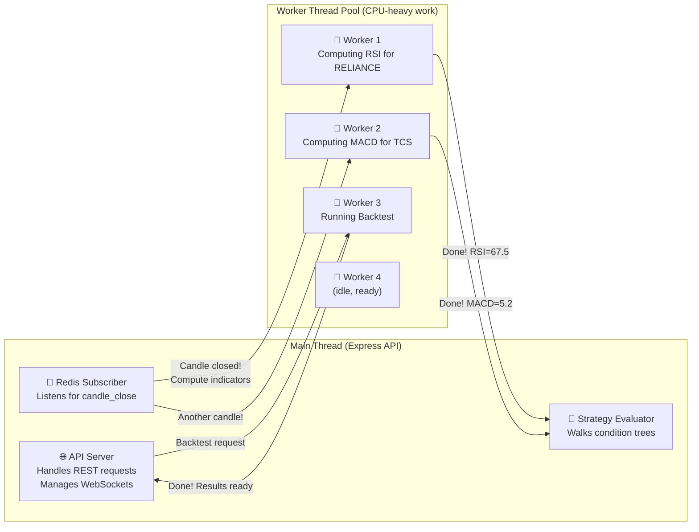

**Why this matters**: Without Worker Threads, computing RSI for 50 stocks would freeze the API server for seconds. With Workers, the API keeps responding to user requests while indicators are computed in parallel on separate CPU cores.

### How the Strategy Engine Reads Your OHLC Data

The engine maps timeframe codes to your existing table names:

```javascript
// src/utils/timeframes.js
const TIMEFRAME_MAP = {
  '1m':  { table: 'OHLC_1MIN',   interval: '1 minute'  },
  '5m':  { table: 'OHLC_5MIN',   interval: '5 minutes' },
  '10m': { table: 'OHLC_10MIN',  interval: '10 minutes' },
  '15m': { table: 'OHLC_15MIN',  interval: '15 minutes' },
  '30m': { table: 'OHLC_30MIN',  interval: '30 minutes' },
  '1h':  { table: 'OHLC_1HOUR',  interval: '1 hour'    },
  '4h':  { table: 'OHLC_4HOUR',  interval: '4 hours'   },
  '1d':  { table: 'OHLC_1DAY',   interval: '1 day'     },
  '1w':  { table: 'OHLC_1WEEK',  interval: '1 week'    }
};

// Reading candles uses your exact column names
async function getCandles(symbol, timeframe, limit = 200) {
  const { table } = TIMEFRAME_MAP[timeframe];
  const { rows } = await marketPool.query(`
    SELECT "Symbol" as symbol, "Time" as ts, 
           "Open" as open, "High" as high, 
           "Low" as low, "Close" as close, "Volume" as volume
    FROM "${table}"
    WHERE "Symbol" = $1
    ORDER BY "Time" DESC
    LIMIT $2
  `, [symbol, limit]);
  return rows.reverse(); // Return in chronological order
}
```

### API Design

#### Indicator APIs

| Method | Endpoint | What it does |
|--------|----------|-------------|
| `GET` | `/api/indicators` | List all available indicators (RSI, SMA, MACD, etc.) |
| `GET` | `/api/indicators/:name` | Get indicator details + what parameters it accepts |
| `GET` | `/api/indicators/compute` | Compute an indicator on-demand (for live preview in UI) |
| `GET` | `/api/indicators/values` | Get stored indicator values for a symbol+timeframe |

#### Strategy APIs

| Method | Endpoint | What it does |
|--------|----------|-------------|
| `GET` | `/api/strategies` | List user's strategies (paginated) |
| `POST` | `/api/strategies` | Create a new strategy |
| `GET` | `/api/strategies/:id` | Get strategy details |
| `PUT` | `/api/strategies/:id` | Update a strategy |
| `DELETE` | `/api/strategies/:id` | Soft-delete a strategy |
| `POST` | `/api/strategies/:id/activate` | Turn on a strategy (start evaluating it) |
| `POST` | `/api/strategies/:id/pause` | Pause a strategy |
| `POST` | `/api/strategies/:id/clone` | Make a copy of a strategy |
| `POST` | `/api/strategies/:id/validate` | Check if conditions are valid (without saving) |

#### Signal APIs

| Method | Endpoint | What it does |
|--------|----------|-------------|
| `GET` | `/api/signals` | List signals (filter by strategy, status, date) |
| `GET` | `/api/signals/:id` | Get signal details with indicator snapshot |
| `GET` | `/api/signals/live` | WebSocket upgrade for real-time signal push |

#### Backtest APIs

| Method | Endpoint | What it does |
|--------|----------|-------------|
| `POST` | `/api/backtests` | Queue a new backtest |
| `GET` | `/api/backtests/:id` | Get backtest status + results |
| `GET` | `/api/backtests/:id/trades` | Get detailed trade log |
| `GET` | `/api/backtests/:id/equity-curve` | Get equity curve data |
| `DELETE` | `/api/backtests/:id` | Delete a backtest run |

#### Template APIs

| Method | Endpoint | What it does |
|--------|----------|-------------|
| `GET` | `/api/templates` | List pre-built strategy templates |
| `GET` | `/api/templates/:id` | Get template details |
| `POST` | `/api/templates/:id/use` | Create a strategy from a template |

---

## Admin Panel Frontend — UI Design

### New Sidebar Section

Add to the existing sidebar `menuItems` array in [Sidebar.jsx](file:///D:/Admin-panel/Victory_Admin_Pannel/src/components/layout/Sidebar/Sidebar.jsx):

```javascript
{
  label: "Strategy Builder",
  icon: <span className="material-symbols-outlined">psychology</span>,
  children: [
    { path: "/strategies",     icon: <span className="material-symbols-outlined">schema</span>,        label: "My Strategies",    permissions: "VIEW_STRATEGIES" },
    { path: "/strategy/new",   icon: <span className="material-symbols-outlined">add_circle</span>,    label: "Create Strategy",  permissions: "VIEW_STRATEGIES" },
    { path: "/signals",        icon: <span className="material-symbols-outlined">notifications_active</span>, label: "Signals",    permissions: "VIEW_SIGNALS" },
    { path: "/backtests",      icon: <span className="material-symbols-outlined">history</span>,       label: "Backtests",        permissions: "VIEW_BACKTESTS" },
    { path: "/templates",      icon: <span className="material-symbols-outlined">dashboard_customize</span>, label: "Templates",  permissions: "VIEW_TEMPLATES" },
    { path: "/indicators",     icon: <span className="material-symbols-outlined">analytics</span>,     label: "Indicators",       permissions: "VIEW_INDICATORS" },
  ]
}
```

### Page Components

```
src/pages/
├── StrategyBuilder/
│   ├── StrategyList/
│   │   ├── StrategyList.jsx         # List of all strategies with status badges
│   │   └── StrategyList.module.css
│   ├── StrategyForm/
│   │   ├── StrategyForm.jsx         # Main strategy builder page
│   │   ├── StrategyForm.module.css
│   │   ├── ConditionBuilder.jsx     # The visual condition tree builder
│   │   ├── ConditionRow.jsx         # One condition row (indicator + comparator + value)
│   │   ├── ConditionGroup.jsx       # AND/OR group container
│   │   ├── IndicatorPicker.jsx      # Dropdown to pick indicator + set params
│   │   ├── SymbolSelector.jsx       # Multi-symbol picker
│   │   ├── RiskSettings.jsx         # SL, TSL, TP, position sizing panel
│   │   └── StrategyPreview.jsx      # JSON preview + validation status
│   └── StrategyDetail/
│       ├── StrategyDetail.jsx       # View mode showing signal history
│       └── StrategyDetail.module.css
├── Signals/
│   ├── SignalDashboard.jsx          # Real-time signal feed
│   └── SignalDashboard.module.css
├── Backtests/
│   ├── BacktestList/
│   │   ├── BacktestList.jsx
│   │   └── BacktestList.module.css
│   └── BacktestDetail/
│       ├── BacktestDetail.jsx       # Charts, equity curve, trade log, metrics
│       └── BacktestDetail.module.css
├── Templates/
│   ├── TemplateList.jsx
│   └── TemplateList.module.css
└── Indicators/
    ├── IndicatorList.jsx            # Browse available indicators with docs
    └── IndicatorList.module.css
```

### Admin Panel — Page Navigation Flow

*How users navigate between the new pages we're adding:*

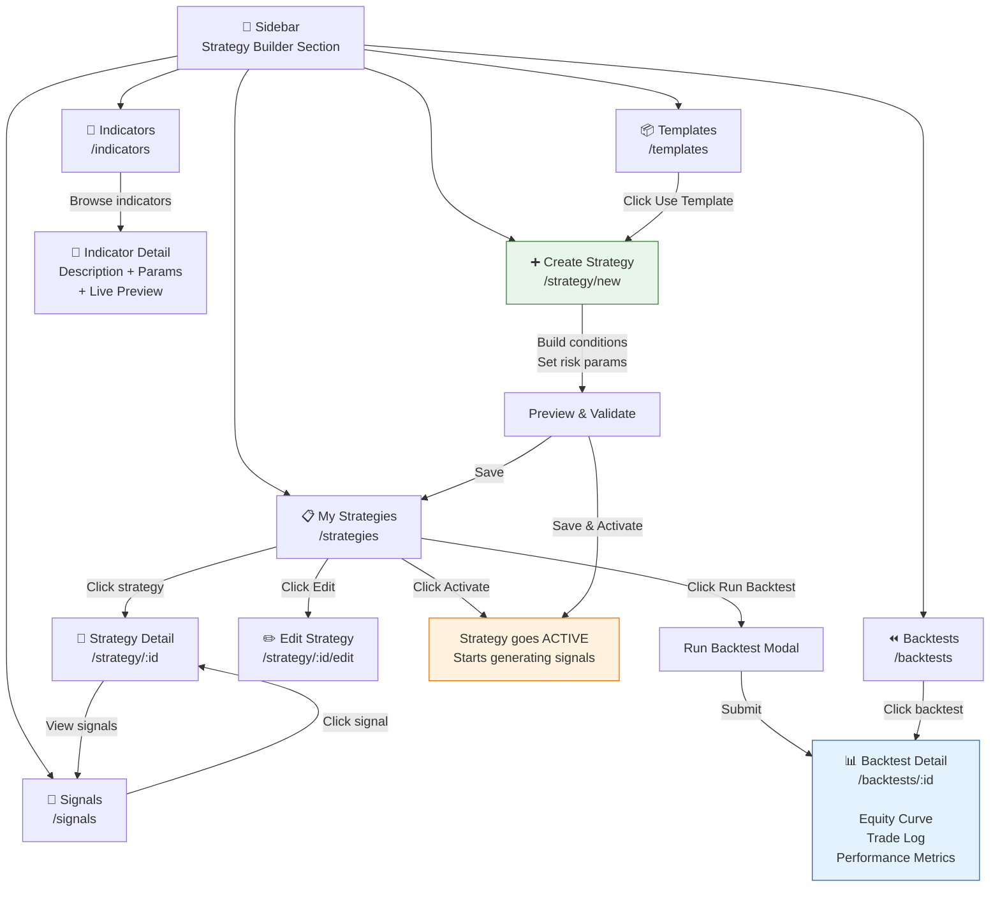

### Strategy Builder UI — How the User Creates a Strategy

The user flow is simple and guided:

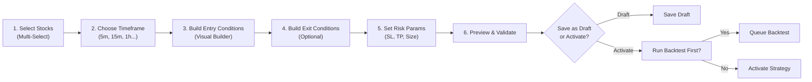

### Condition Builder UI — What the User Sees

This is the core UX piece. Each row lets the user pick an indicator, a comparison, and a value — no coding required:

```
┌─────────────────────────────────────────────────────────────────────┐
│ [AND ▾]                                                    [+ Add] │
│ ┌─────────────────────────────────────────────────────────────────┐ │
│ │ [RSI ▾] [Period: 14] [5m ▾]  [> ▾]  [Constant ▾] [60    ]  ✕ │ │
│ └─────────────────────────────────────────────────────────────────┘ │
│ ┌─────────────────────────────────────────────────────────────────┐ │
│ │ [SMA ▾] [Period: 10] [5m ▾]  [crosses above ▾]                │ │
│ │                       [SMA ▾] [Period: 20] [5m ▾]            ✕ │ │
│ └─────────────────────────────────────────────────────────────────┘ │
│ ┌ [OR ▾] ──────────────────────────────────────────────── [+ Add]┐ │
│ │ ┌───────────────────────────────────────────────────────────┐   │ │
│ │ │ [Volume ▾]              [> ▾]  [Constant ▾] [100000] ✕   │   │ │
│ │ └───────────────────────────────────────────────────────────┘   │ │
│ │ ┌───────────────────────────────────────────────────────────┐   │ │
│ │ │ [Time ▾]                [> ▾]  [09:20      ]          ✕   │   │ │
│ │ └───────────────────────────────────────────────────────────┘   │ │
│ └────────────────────────────────────────────────────────────────┘ │
│                                                    [+ Add Group]   │
└─────────────────────────────────────────────────────────────────────┘
```

### Condition Builder — Component Hierarchy

*How the React components nest to form the visual builder:*

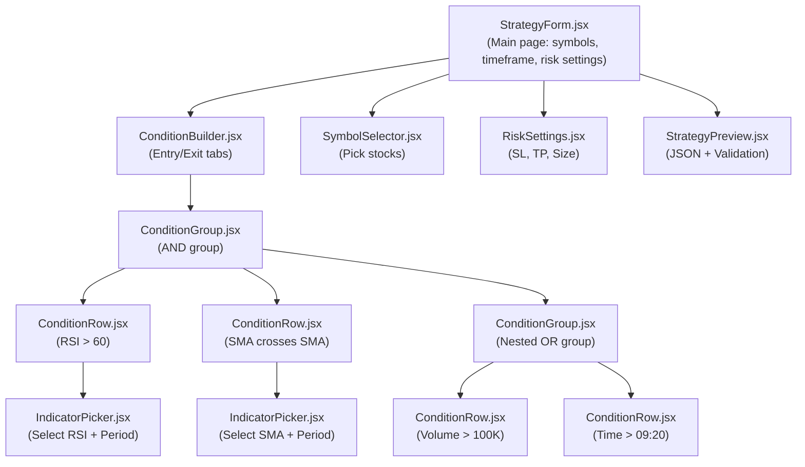

---

## Indicator Computation Engine — How Indicators Are Calculated

### The Pipeline (Step by Step)

When a new candle closes, here's exactly what happens:

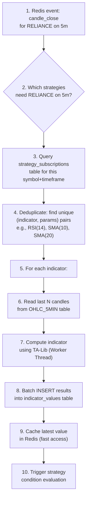

**Why Worker Threads?** TA-Lib does heavy math (especially for MACD, Ichimoku with 100+ candles). Running this on the main thread would freeze the Express API server. Worker Threads run in parallel on a separate CPU core.

### How Each Indicator is Implemented

Every indicator follows the same pattern. Here's RSI as an example:

```javascript
// src/services/indicatorEngine/indicators/rsi.js
const talib = require('talib');

module.exports = {
  name: 'RSI',
  displayName: 'Relative Strength Index',
  category: 'momentum',
  defaultParams: { period: 14 },
  paramSchema: {
    period: { type: 'integer', min: 2, max: 100, default: 14 }
  },
  outputFields: ['value'],           // RSI has one output
  outputLabels: { value: 'RSI' },
  
  // RSI(14) needs at least 15 candles to compute
  requiredCandles: (params) => params.period + 1,
  
  /**
   * Compute latest RSI value
   * @param {Array} candles - [{open, high, low, close, volume, ts}, ...]
   * @param {Object} params - { period: 14 }
   * @returns {{ value: number }} - e.g., { value: 67.5 }
   */
  compute(candles, params) {
    const { period } = params;
    const closes = candles.map(c => c.close);
    const result = talib.execute({
      name: 'RSI',
      startIdx: 0,
      endIdx: closes.length - 1,
      inReal: closes,
      optInTimePeriod: period
    });
    return { value: result.result.outReal[result.result.outReal.length - 1] };
  },
  
  /**
   * Compute full series (for backtesting and charting)
   * @returns {Array<{ts, value}>}
   */
  computeSeries(candles, params) {
    const closes = candles.map(c => c.close);
    const result = talib.execute({
      name: 'RSI',
      startIdx: 0,
      endIdx: closes.length - 1,
      inReal: closes,
      optInTimePeriod: params.period
    });
    // Align output with candle timestamps
    const offset = candles.length - result.result.outReal.length;
    return result.result.outReal.map((val, i) => ({
      ts: candles[i + offset].ts,
      value: val
    }));
  }
};
```

### Multi-Output Indicators — How value, value2, value3 Work

Some indicators produce multiple lines. Here's how they map:

| Indicator | `value` (primary) | `value2` (secondary) | `value3` (tertiary) |
|-----------|---------|----------|----------|
| SMA | SMA value | — | — |
| RSI | RSI value | — | — |
| MACD | MACD line | Signal line | Histogram |
| Bollinger Bands | Middle band | Upper band | Lower band |
| Stochastic | %K | %D | — |
| Ichimoku | Tenkan-sen | Kijun-sen | Senkou Span A |
| SuperTrend | ST value | Direction (1/-1) | — |

---

## Strategy Evaluation Engine — How Conditions Are Checked

### The Core Logic

The evaluator walks through the condition tree recursively. Think of it like evaluating a nested IF statement:

```javascript
// Pseudocode — this is the heart of the strategy engine
function evaluateConditionTree(tree, context) {
  if (tree.operator) {
    // It's a group (AND/OR)
    const results = tree.conditions.map(c => evaluateConditionTree(c, context));
    
    if (tree.operator === 'AND') {
      return results.every(Boolean);  // ALL must be true
    } else {
      return results.some(Boolean);   // ANY must be true
    }
  }
  
  // It's a leaf condition (actual comparison)
  switch (tree.type) {
    case 'indicator':
      return evaluateIndicatorCondition(tree, context);
    case 'indicator_cross':
      return evaluateCrossCondition(tree, context);
    case 'price':
      return evaluatePriceCondition(tree, context);
    case 'time':
      return evaluateTimeCondition(tree, context);
    case 'change':
      return evaluateChangeCondition(tree, context);
  }
}
```

### How Crossover Detection Works

A crossover happens when line A was BELOW line B in the previous candle, but is NOW ABOVE it (or vice versa). We need both current and previous values:

```javascript
function evaluateCrossCondition(condition, context) {
  const leftCurrent  = getIndicatorValue(condition.left, context, 0);   // current candle
  const leftPrevious = getIndicatorValue(condition.left, context, -1);  // previous candle
  const rightCurrent  = getIndicatorValue(condition.right, context, 0);
  const rightPrevious = getIndicatorValue(condition.right, context, -1);
  
  switch (condition.cross_type) {
    case 'crosses_above':
      // Was below or equal, now above
      return leftPrevious <= rightPrevious && leftCurrent > rightCurrent;
    case 'crosses_below':
      // Was above or equal, now below
      return leftPrevious >= rightPrevious && leftCurrent < rightCurrent;
  }
}
```

---

## Backtest Engine — How Historical Testing Works

When a user clicks "Run Backtest", here's exactly what happens:

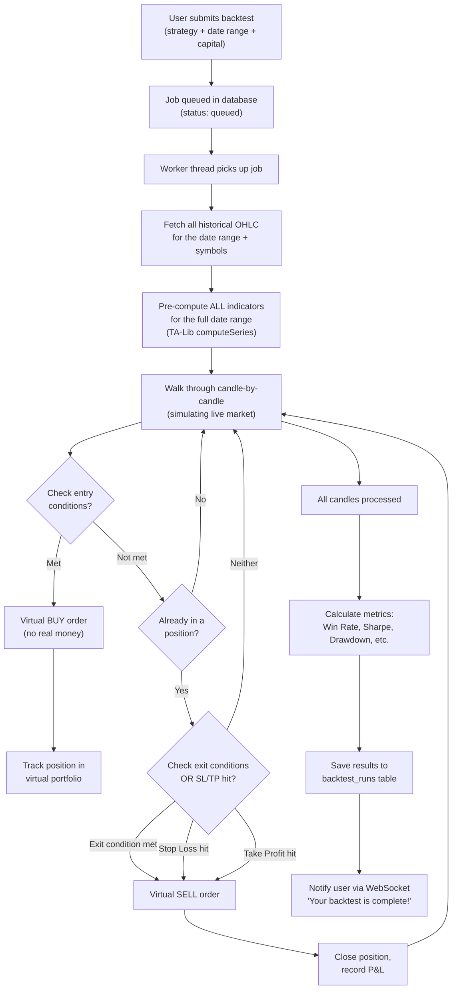

### Performance Metrics Calculated

| Metric | What it tells you |
|--------|-------------------|
| **Total P&L** | How much money you would have made or lost |
| **Win Rate** | What % of your trades were profitable |
| **Profit Factor** | Gross profit ÷ Gross loss. Above 1.0 = profitable overall |
| **Sharpe Ratio** | Return adjusted for risk. Higher = better risk-adjusted returns |
| **Max Drawdown** | The worst peak-to-trough decline — your worst losing streak |
| **Avg Win / Avg Loss** | Average profit per winning trade vs average loss per losing trade |
| **Max Consecutive Wins/Losses** | Longest winning or losing streak |
| **Calmar Ratio** | Annual return ÷ Max drawdown — how well does return compensate for risk |

---

## Risk Management Engine

### Stop Loss Types

```javascript
// Users can choose from these SL types when creating a strategy
const stopLossTypes = {
  fixed:       { type: 'fixed',       value: 150 },        // ₹150 below entry price
  percentage:  { type: 'percentage',  value: 2 },           // 2% below entry price
  atr:         { type: 'atr',         multiplier: 2, period: 14 }, // 2×ATR(14) below entry
  indicator:   { type: 'indicator',   indicator: 'SuperTrend', params: { period: 10, multiplier: 3 } }
};
```

### Trailing Stop Loss — How It Works

A trailing SL moves UP as price goes up (locking in profits), but never moves DOWN:

```javascript
function updateTrailingSL(position, currentPrice, config) {
  const { type, value, activation } = config;
  
  // Only start trailing after position is in profit by 'activation' %
  // Example: activation=3 means TSL only kicks in after 3% profit
  const profitPct = ((currentPrice - position.entryPrice) / position.entryPrice) * 100;
  if (profitPct < activation) return position.currentSL;
  
  let newSL;
  if (type === 'percentage') {
    newSL = currentPrice * (1 - value / 100);   // e.g., 1% below current price
  } else if (type === 'fixed') {
    newSL = currentPrice - value;                // e.g., ₹10 below current price
  }
  
  // Key rule: SL only moves UP, never DOWN (protecting profits)
  return Math.max(position.currentSL || 0, newSL);
}
```

---

## Scalability Strategy

### Phase 1 — Up to 1,000 Strategies (Current Target)

| Component | Approach | Why this is enough |
|-----------|----------|-------------------|
| Indicator computation | Single Node.js process + Worker Threads | Sufficient for <5K symbol-indicator pairs |
| Strategy evaluation | In-process, triggered by Redis Pub/Sub | Low latency, simple architecture |
| Backtest | Worker thread, one at a time per user | Good enough for initial usage |
| Database | Shared PostgreSQL + TimescaleDB | Existing infra, no new services |
| Cache | Existing Redis instance | Already available |

### Phase 2 — 10,000+ Strategies

| Component | Upgrade | Why |
|-----------|---------|-----|
| Indicator computation | BullMQ job queues with multiple workers | Distribute CPU work across cores |
| Strategy evaluation | Batch evaluation (group strategies by symbol+timeframe) | 100 strategies on RELIANCE-5m = 1 indicator fetch, not 100 |
| Backtest | Dedicated backtest worker process | Isolate backtest CPU from live evaluation |
| Database | Read replicas for backtest queries | Don't slow down live indicator writes |

### Phase 3 — 100,000+ Strategies

| Component | Upgrade | Why |
|-----------|---------|-----|
| Architecture | Kubernetes pods with auto-scaling | Horizontal scaling |
| Message queue | Kafka for tick distribution | Guaranteed delivery, replay capability |
| Indicator computation | Distributed workers partitioned by symbol hash | Scale by adding machines |
| Database | TimescaleDB multi-node | Distribute time-series storage |
| Caching | Redis Cluster | High-availability cache |

---

## Deployment Architecture

### Your Setup — Two Separate Servers

```
┌──────────── Server 1 (Existing EC2) ────────────┐
│                                                   │
│  ┌──────────────┐       ┌──────────────┐         │
│  │  Existing     │       │  Redis       │         │
│  │  Backend      │       │  (existing)  │         │
│  │  :3002        │       │  :6379       │         │
│  └──────────────┘       └──────────────┘         │
│                                                   │
│  ┌─────────────────────────────────────────────┐ │
│  │  PostgreSQL + TimescaleDB                    │ │
│  │  victory_db  |  victory_market_db            │ │
│  └─────────────────────────────────────────────┘ │
└───────────────────────────────────────────────────┘
          ▲ DB connections (same credentials)
          │ Redis connection (same URL)
          │
┌──────────── Server 2 (New Server) ──────────────┐
│                                                   │
│  ┌──────────────────┐                            │
│  │  Strategy Engine  │                            │
│  │  Service          │                            │
│  │  :3003            │                            │
│  └──────────────────┘                            │
│                                                   │
│  ┌──────────────────┐                            │
│  │  Nginx            │                            │
│  │  (Reverse Proxy)  │                            │
│  │  /strategy-api/*  │                            │
│  │     → :3003       │                            │
│  └──────────────────┘                            │
└───────────────────────────────────────────────────┘
```

**Key points:**
- Strategy Engine connects to the **same PostgreSQL** and **same Redis** as your existing backend (remote connections)
- Your existing backend publishes `candle_close` events to Redis; Strategy Engine subscribes to them
- Admin Panel sends API calls to the Strategy Engine server directly (via Nginx or direct URL)

### Docker Compose (Phase 2)

```yaml
services:
  strategy-engine:
    build: ./StrategyEngine
    ports: ["3003:3003"]
    depends_on: [redis]
    environment:
      - NODE_ENV=production
      - PG_HOST=<your-existing-db-host>
      - PG_DATABASE=victory_db
      - MARKET_DB_HOST=<your-existing-db-host>
      - MARKET_DB_DATABASE=victory_market_db
      - REDIS_URL=redis://<your-existing-redis-host>:6379
    deploy:
      resources:
        limits:
          cpus: '2'
          memory: 2G

  strategy-worker:
    build: ./StrategyEngine
    command: node src/workers/indicatorWorker.js
    depends_on: [redis]
    deploy:
      replicas: 2
```

---

## One Change Needed in Existing Backend

The Strategy Engine needs to know when a new candle closes. Your existing backend already saves candles via `insertOhlc()` in [ohlc.model.js](file:///D:/Backend/new_backend/src/models/ohlc.model.js). We need to add **one line** to publish a Redis event after a candle is saved:

```javascript
// In ohlc.model.js, after the INSERT query succeeds:
// Publish event for Strategy Engine to pick up
await redisClient.publish('ohlc:candle_close', JSON.stringify({
  symbol, exchange, timeframe: tableName, ts: sqlTs.toISOString()
}));
```

This is the **only change** to the existing backend. Everything else is in the new Strategy Engine service.

---

## Security

| Concern | How we handle it |
|---------|-----------------|
| **Authentication** | Same JWT secret as existing backend. Token extracted from cookie or Authorization header. Users logged into admin panel are automatically authenticated with Strategy Engine. |
| **Authorization** | Same RBAC model. New permissions: `VIEW_STRATEGIES`, `VIEW_SIGNALS`, `VIEW_BACKTESTS`, `VIEW_TEMPLATES`, `VIEW_INDICATORS` |
| **Rate Limiting** | `express-rate-limit` — 100 requests/min for API, 10 requests/min for backtest submissions |
| **Input Validation** | Joi/Zod schema validation on all strategy condition trees before saving to DB |
| **SQL Injection** | Parameterized queries only (same pattern as existing backend) |
| **Condition Tree Safety** | Max depth: 5 levels, max conditions: 50, max symbols per strategy: 100 |
| **Backtest Abuse** | Max concurrent backtests per user: 3, max date range: 2 years |
| **CORS** | Only your admin panel domain is allowed |

---

## Monitoring & Observability

| What to track | How | Why |
|---------------|-----|-----|
| Indicator computation time | Console logger (Phase 1), Prometheus (Phase 2) | Know if TA-Lib is getting slow |
| Strategy evaluation latency | Timer middleware | Time from candle close → signal generated |
| Active strategies count | Periodic counter | Capacity planning |
| Backtest queue depth | BullMQ dashboard (Phase 2) | Are backtests piling up? |
| DB connection pool | `pg` pool events | Running out of connections? |
| Redis memory | Redis INFO | Cache growing too large? |
| Error rates | Error handler middleware | Something breaking? |

---

## Verification Plan

### Automated Tests

```bash
# Run database migrations
node src/migrations/run.js

# Unit tests — verify indicator math is correct
npm test -- --testPathPattern="indicators"

# Integration tests — verify API endpoints work
npm test -- --testPathPattern="routes"

# Backtest accuracy — run known strategy, check results match
npm test -- --testPathPattern="backtest.accuracy"
```

### Manual Verification

1. **Indicator accuracy**: Compare RSI(14), SMA(20) values against TradingView for same symbol/timeframe/date
2. **Strategy evaluation**: Create a test strategy with known conditions, manually verify signal generation
3. **Backtest correctness**: Run a simple SMA crossover strategy on historical data, manually verify trade entries/exits
4. **Admin panel UI**: Visual walkthrough of strategy creation flow, condition builder, backtest results
5. **WebSocket signals**: Activate a strategy during market hours, verify real-time signal delivery

---

## Phase-Wise Implementation Roadmap

### Phase 1 — Foundation (4-6 weeks)
- [ ] Project scaffolding, DB migrations, seed data
- [ ] Indicator engine with TA-Lib (all 15 base indicators)
- [ ] Strategy CRUD APIs
- [ ] Condition tree evaluator
- [ ] Admin panel: Strategy list + form + condition builder
- [ ] Basic signal generation
- [ ] Manual indicator computation endpoint

### Phase 2 — Backtesting & Real-Time (3-4 weeks)
- [ ] Backtest engine with worker threads
- [ ] Backtest results UI (equity curve, trade log, metrics)
- [ ] Redis Pub/Sub integration for real-time indicator updates
- [ ] Real-time strategy evaluation pipeline
- [ ] WebSocket signal push to admin panel
- [ ] Strategy templates (pre-built strategies)

### Phase 3 — Risk & Polish (2-3 weeks)
- [ ] Risk management engine (SL, TSL, TP, position sizing)
- [ ] Signal dashboard with real-time feed
- [ ] Strategy performance tracking
- [ ] Indicator registry UI in admin panel
- [ ] Custom indicator support (user-defined formulas)

### Phase 4 — Scaling & Production (2-3 weeks)
- [ ] BullMQ worker queues for indicator computation
- [ ] Docker containerization
- [ ] Nginx reverse proxy configuration
- [ ] Monitoring and alerting setup
- [ ] Load testing and optimization
- [ ] Production deployment

### Future Phases
- Paper trading with virtual portfolio
- Live trading with broker integration (existing Angel One / Dhan adapters)
- Strategy marketplace
- AI-generated strategies
- Multi-timeframe condition support in single strategy
- Mobile app integration

---

## Potential Bottlenecks & How We Handle Them

| Problem | Impact | Solution |
|---------|--------|----------|
| 5000 stocks × 15 indicators × 7 timeframes = **525K computations per candle close** | CPU overload | Only compute indicators that active strategies actually need (subscription-based). 10 active strategies watching 20 stocks = only ~300 computations, not 525K. |
| Reading OHLC data on every candle close | DB I/O spike | Cache last N candles per symbol+timeframe in Redis. Only read from DB on cold start. |
| `indicator_values` table growing fast (millions of rows/day) | Storage + slow queries | TimescaleDB auto-compression (90% size reduction after 7 days) + 90-day retention policy |
| Backtest on 2 years of 1-min data (500K+ candles per symbol) | Memory + CPU spike | Stream candles in chunks, compute indicators incrementally, run in Worker Thread |
| 100 strategies watching RELIANCE on 5m = 100 separate indicator computations | Wasted CPU | Group strategies by (symbol, timeframe), compute each indicator once, share results across all strategies |
| Parsing JSONB condition tree on every evaluation | CPU waste | Pre-parse and cache condition tree AST when strategy is activated |

---

## Key Tradeoffs Summary

| Decision | What we chose | What we didn't choose | Why |
|----------|--------------|----------------------|-----|
| Separate service vs monolith | Separate service on new server | Add to existing 132-controller backend | CPU isolation, independent scaling, clean separation |
| Indicator storage | Generic `indicator_values` table | Add columns to OHLC tables or per-indicator tables | Extensibility with zero schema changes, zero risk to existing tables |
| Indicator library | TA-Lib (native C) | `technicalindicators` (pure JS) | Maximum performance for production-grade indicator computation |
| Message queue | Redis Pub/Sub | Kafka | Already have Redis, Kafka is overkill for Phase 1 |
| Worker Threads vs Child Processes | Worker Threads | Child Processes | Shared memory, lower overhead, built into Node.js |
| Condition storage | JSONB tree in strategies table | Normalized condition tables | Simpler queries, atomic reads, flexible nesting, no N+1 queries |
| Deployment | Separate server | Same EC2 instance | CPU isolation, can scale independently |
